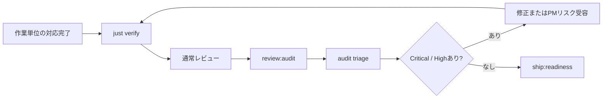

# Workflows / ワークフロー

開発フローとコマンドの対応、作業単位、Rigor Mode、Handoff、レビューループを定義します。
ロールの責務は[`roles.md`](roles.md)を参照してください。

## 目次

- [1. 作業単位とMode検出](#1-作業単位とmode検出)
- [2. フェーズとコマンド](#2-フェーズとコマンド)
- [3. 自然言語ルーティング](#3-自然言語ルーティング)
- [4. フェーズ状態](#4-フェーズ状態)
  - [4.1. 並列worktree状態](#41-並列worktree状態)
- [5. Handoff契約](#5-handoff契約)
- [6. レビューループプロトコル](#6-レビューループプロトコル)
- [7. ループガードレール](#7-ループガードレール)
- [8. Audit Gate](#8-audit-gate)

## 1. 作業単位とMode検出

ブランチ名から作業の種別・IDとRigor Modeを自動検出し、実行前に検出結果を報告します。

**milestone と issue の関係**: milestone は大きな目標・機能単位(複数の issue を含む場合も)、
issue は単一の実装可能な変更です。両者は粒度の違いであり、Prototype / Production 両 Mode
で使用できます。`{work-dir}` はブランチ名から `milestone-N` または `issue-N` に解決されます。

| ブランチパターン | 種別 | Rigor Mode |
| --- | --- | --- |
| `m{N}-slug`(例: `m0-structure`) | milestone-N | Prototype |
| `prototype` | (プロジェクト全体) | Prototype |
| `type/issue-N-topic`(例: `feat/issue-12-profile-resolver`) | issue-N | Production |
| `main` | (プロジェクト全体) | Production |
| 上記に該当しない | 検出不可 | 実行前にPMへ確認 |

Rigor Modeで使わない/読み替えるコマンドは次の通りです。

| Mode | 使わない/読み替えるコマンド | ship相当 |
| --- | --- | --- |
| Prototype | `ship:pr`のpush/PR部分、Audit Gateの必須化 | `m{N}-slug`ブランチへ段階commit → `prototype`へfast-forward merge |
| Production | 制限なし | `/ship:pr`でPR作成、Audit Gate必須 |

## 2. フェーズとコマンド

`think → plan → build(docs) → build(test) → run(red) → build(impl) → run(green) →
review(audit) → ship`とコマンドの対応です。

| フェーズ | コマンド | 担当Role |
| --- | --- | --- |
| 事前確認 | `/think:clarify` / `/think:risks` / `/think:investigate` | Architect |
| 要件定義 | `/plan:requirements` | Architect |
| アーキテクチャ設計 | `/plan:architecture` | Architect |
| マイルストーン/Issue設計 | `/plan:design` | Architect |
| テスト先行 | `/build:test` | Programmer |
| RED確認 | `/build:test`内で実施 | Programmer |
| 実装 | `/build:implement` | Programmer |
| GREEN確認 | `/build:implement`内で実施 | Programmer |
| 文書同期・commit | `/build:docs` | Programmer |
| 検証 | `/verify` / `/verify:handoff` | Tester |
| レビュー | `/review:code`等 / `/review:audit` | Reviewer |
| 出荷判定 | `/ship:readiness` | Reviewer |
| 記録と出荷 | `/ship:pr`(Production Modeのみ) | Programmer→Reviewer |

## 3. 自然言語ルーティング

フェーズ作業の意図を検出した場合、対応するコマンドを提示してから実行します。調査・質問・
軽微な修正には適用しません。

| 入力例 | 誘導先 |
| --- | --- |
| 「確認したい」「曖昧な点を洗って」 | `/think:clarify` |
| 「リスクを見て」「危なそうな点は?」 | `/think:risks` |
| 「事実確認して」「再現確認して」「ブランチ確認して」 | `/think:investigate` |
| 「要件をまとめて」「仕様を固めたい」 | `/plan:requirements` |
| 「構成を設計して」「アーキテクチャを見直して」 | `/plan:architecture` |
| 「このマイルストーン/Issueの設計をして」 | `/plan:design` |
| 「文書を同期して」「READMEも直して」 | `/build:docs` |
| 「テストを先に書いて」 | `/build:test` |
| 「実装して」「続きを作って」 | `/build:implement` |
| 「動作確認して」「検証して」 | `/verify` |
| 「次フェーズに渡せる?」「引き継ぎ確認して」 | `/verify:handoff` |
| 「出荷できる?」「PR前チェックして」 | `/ship:readiness` |
| 「PRにして」「出荷して」(Production Modeのみ) | `/ship:pr` |
| 「今どこ?」「進捗は?」「次は?」 | `/status` |
| 「レビューして」 | `/review:code`(差分)または`/review:design`(提案) |
| 「ドキュメントレビューして」 | `/review:docs` |
| 「テストレビューして」 | `/review:test` |
| 「セキュリティレビューして」 | `/review:security` |
| 「辛辣レビューして」「監査して」「全体を厳しく見て」 | `/review:audit` |
| 「全部進めて」「任せる」「自動で進めて」 | `/auto:milestone`(Prototype) / `/auto:issue`(Production) |

## 4. フェーズ状態

milestone/issue ごとの進行状態は `tmp/milestone-{N}/phase-state.json`(Prototype) または
`tmp/issue-{N}/phase-state.json`(Production) を正本とします。

```json
{
  "completed": ["design", "test", "implement"],
  "skipped": [],
  "skip_reasons": {},
  "current": "docs"
}
```

- フェーズ名: `investigate` → `design` → `test` → `implement` → `docs` → `verify` → `review` → `ship`
- ファイルパスはブランチ名(`m{N}-slug` → `milestone-N`、`type/issue-N-topic` → `issue-N`)から決定します
- テスト先行をスキップした場合は`skipped`へ`test`を追加し、`skip_reasons`へ理由を記録します
- 各コマンドは開始時に読み込み、完了時に冪等に更新します。ファイルが無い場合は空状態として扱います
- マイルストーン単位の完了条件は`docs/milestones/m{N}-*.md`の「完了条件」節が正本です。
  `phase-state.json`は開発フローの進行、マイルストーン文書は成果物の完成度、という別の軸を
  記録します(両者は補完関係で、どちらかに一本化しません)
- 進行表示は記号で統一します: `✓`完了 / `▶`進行中 / `⊘`スキップ / `□`未着手

### 4.1. 並列worktree状態

primary manager worktreeの`tmp/worktrees.json`はIssue・worktree・担当ツールの関連付けを
管理します。Git worktreeの実在、各Issueの`phase-state.json`、GitHub PR状態はそれぞれの
正本を維持し、`/manage:status`が観測値をレジストリへ同期します。スキーマと命名は
[`naming-policy.md 3.`](naming-policy.md#3-ファイルとディレクトリ名)を参照してください。

レジストリが失われても外部の正本から実在とフェーズを再確認できますが、担当ツールの割当は
復元できません。推測で補完せず`null`としてPMへ確認します。

## 5. Handoff契約

Role間の引き渡しは完了条件を満たした場合にのみ行います。

| Handoff | 送出→受取 | 完了条件 |
| --- | --- | --- |
| 設計→実装 | Architect→Programmer | 設計提案がApproved、テスト方針が記載済み |
| テスト先行→実装 | Programmer(test)→Programmer | テストがREDで失敗することを確認済み、またはスキップ理由を記録済み |
| 実装→レビュー | Programmer→Reviewer | 検証成功、差分とレポートが提示可能 |
| レビュー→出荷 | Reviewer→Manager | Critical / High指摘が0件 |

未解決事項がある場合は送出側で保留し、Handoff前にPMへ報告します。

## 6. レビューループプロトコル

評価軸は各`review:`コマンドが定義し、ループ機構は本プロトコルに従います。

| 項目 | 仕様 |
| --- | --- |
| 実行主体 | 利用可能なsubagent機構へ委譲します(権限は`read-only` / `tmp-write`) |
| 出力先 | `tmp/milestone-{N}/{prefix}-review.md`(Prototype) / `tmp/issue-{N}/{prefix}-review.md`(Production)。上書き方式。前版の指摘テーブルを新版冒頭へ埋め込みます |
| 終了条件 | Critical / High指摘が0件(Medium / Lowは記録のみ) |
| ループ上限 | 3回。未解消なら意思決定レポートでPMへ方針を確認します |
| 残存指摘 | Medium / LowはPR本文(Production Mode)またはマイルストーン文書の「未対応事項」へ転記します |

## 7. ループガードレール

自律ループ(`/auto:milestone` / `/auto:issue`、レビューループ、反復修正)に共通する定量上限です。値は運用実績で
見直します。

| 上限 | 値 | 超過時 |
| --- | --- | --- |
| 反復回数 | 3 | 停止して意思決定レポート |
| 同一エラーの再発 | 2回 | 停止して原因を報告 |
| 変更ファイル数 | 8 | 停止して分割案を提示 |
| 差分行数 | 500 | 停止して分割案を提示 |
| 新規ファイル数 | 5 | 停止して分割案を提示 |
| 同時subagent数 | 3 | 超過起動しない |
| 同時Issue worktree数 | 3 | 既存worktreeの完了・cleanupを先に促す |

同時Issue worktree数は、レジストリに登録され、かつ`git worktree list --porcelain`で実在する
Issue worktreeを数えます。`active`・`blocked_quota`・`pending_cleanup_approval`はいずれも、
worktreeが削除されるまで上限を消費します。subagent数とは別の上限です。

定量上限とは別に、次に該当した時点でループを止めてPMへ委譲します。

- 設計判断、または依存関係の追加・更新が必要になった
- 秘密情報・認証認可・外部公開へ影響が及ぶ
- スコープ外のファイルへ変更が広がった
- 根拠を説明できない変更が生じた

| 区分 | 作業 |
| --- | --- |
| ループとして許可 | lint / format修正、型エラー修正、テスト失敗の軽微な修正、文書とコードの同期、明確な受入条件のある小変更 |
| ループ禁止(人間承認が必要) | mainへのマージ、リリース、外部送信、依存の追加・更新、大規模リファクタ、設計方針の変更 |

## 8. Audit Gate

Audit Gateは、マイルストーン完了宣言とリリース前(Production Mode)に実行する横断品質
ゲートです。Prototype Modeでは必須にしません(通常のレビューループで代替します)。



| 項目 | ルール |
| --- | --- |
| 監査原文 | `tmp/audit/`へ置き、恒久的な進捗台帳にしません |
| Triage結果 | Production ModeはGitHub Issue、Prototype Modeはマイルストーン文書の「前提とする未解決事項」を正本にします |
| Critical / High | 修正またはPMの明示的なリスク受容まで完了不可です |
| Medium / Low | マイルストーン文書の未対応事項、またはPR本文へ分解できます |
