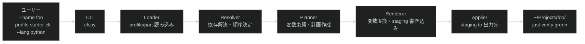

# _template コアアーキテクチャ

生成パイプラインの構造、Part レイヤー構成、モジュール責務を定義します。

## 目次

- [1. 生成パイプライン](#1-生成パイプライン)
- [2. Part レイヤー構成](#2-part-レイヤー構成)
- [3. モジュール責務](#3-モジュール責務)
- [4. 依存方向](#4-依存方向)
- [5. 失敗と再実行](#5-失敗と再実行)
- [6. 目標設計（フェーズ4以降）](#6-目標設計フェーズ4以降)
- [7. 未解決の論点](#7-未解決の論点)

## 1. 生成パイプライン



## 2. Part レイヤー構成

### 現行実装

| レイヤー | Parts | 役割 |
| --- | --- | --- |
| `base` | `base` | 全プロファイル共通基盤（Nix flake・just・pre-commit・CI） |
| `scale` | `scale/small` | ドキュメント骨格（`docs/draft/`） |
| `starter` | `starter/cli` / `starter/web-api` / `starter/library` / `starter/web-htmx` | 用途別 src 骨格（lang 非依存、README 等） |
| `starter`（複合） | `starter/cli-python` / `starter/web-api-python` / `starter/library-python` / `starter/web-api-rust` / `starter/web-htmx-rust` | 用途別 src 実装（`src/main.py`・axum・askama等）。対応する `starter/<id>` + `lang/<x>` が揃った場合のみ`--lang <x>`指定時にCLIが追加注入する |
| `lang` | `lang/python` / `lang/typescript` / `lang/rust` / `lang/go` | 言語環境（flake.nix replace・treefmt・justfile・.gitignore）。`lang/rust`はWebAPI等の複合Partが積む基盤依存(tracing/serde/anyhow等)もCargo.tomlに含む |
| `features` | `features/ai-agent` / `features/github-project` / `features/github-rulesets` / `features/logging-*` | オプション機能 |

### 現行プロファイル

```text
starter-cli       = base + scale/small + starter/cli       + features/*  (+ starter/cli-<lang>       if --lang <lang> and it exists)
starter-web-api   = base + scale/small + starter/web-api   + features/*  (+ starter/web-api-<lang>   if --lang <lang> and it exists)
starter-library   = base + scale/small + starter/library   + features/*  (+ starter/library-<lang>   if --lang <lang> and it exists)
starter-web-htmx  = base + scale/small + starter/web-htmx  + features/*  (+ starter/web-htmx-<lang>  if --lang <lang> and it exists)
```

`--lang`省略時はsrc骨格(README等)のみが生成されます。`--lang python`時は対応する`-python`
複合Partが自動で追加注入され、現状と同じPython実装が生成されます。

## 3. モジュール責務

| モジュール | 責務 | 責務外 |
| --- | --- | --- |
| `cli.py` | 引数解析・LangSpec 生成・lang Parts 注入・エラー出力・終了コード制御 | ビジネスロジック |
| `loader.py` | profile.toml / part.toml のデシリアライズ・lang Parts の読み込み | バリデーション以外のロジック |
| `resolver.py` | Part 間の依存解決・適用順序の決定 | ファイル生成 |
| `planner.py` | 変数束縛・生成ファイル計画の作成・ファイル競合検出 | ファイル I/O |
| `renderer.py` | `{{変数}}` 置換・staging ディレクトリへの書き込み | 出力先への直接書き込み |
| `applier.py` | staging から出力先への原子的コピー | レンダリングロジック |
| `models.py` | データ型定義（LangSpec / GenerateRequest / GenerationPlan / GenerationResult） | ビヘイビア |
| `errors.py` | 各段階エラー型 | ビヘイビア |
| `template/schema/` | ProfileSchema / PartSchema の定義・検証 | 生成ロジック |
| `template/profiles/` | Profile 宣言（使用 Part リスト・変数定義） | Part の内容 |

## 4. 依存方向

```text
tooling.generator.cli
  ├── tooling.generator.loader   ──→ template.schema
  ├── tooling.generator.resolver
  ├── tooling.generator.planner
  ├── tooling.generator.renderer
  └── tooling.generator.applier
           └── tooling.generator.models（データのみ・他モジュールへの依存なし）
```

`tooling.generator` → `template.schema`（一方向）。逆方向の依存は禁止。
`template.parts`・`template.profiles` は実行時のファイル読み込み（Python import なし）。

## 5. 失敗と再実行

| 失敗 | 段階 | 動作 |
| --- | --- | --- |
| `--lang` に複数指定 | CLI | エラー終了（M6+ 対応予定） |
| `--lang` に未知の言語名 | CLI | エラー終了・利用可能一覧表示 |
| profile.toml が見つからない | LOAD | エラー終了・利用可能 Profile 一覧表示 |
| Part 依存の循環・未解決 | RESOLVE | エラー終了・問題 Part ID を報告 |
| ファイル名衝突 | PLAN | エラー終了・競合ファイル名と関連 Part を報告 |
| 出力先ディレクトリが既存 | APPLY | エラー終了・上書きしない |

**冪等性:** APPLY 前に全出力を staging へ書き込むため、失敗時は出力先に何も残らない。再実行は安全。

## 6. 目標設計（フェーズ4以降）

> [!NOTE]
> 以下は現行実装ではなく、フェーズ4 以降で実現する目標設計です。

### 6.1. Part レイヤー構成（目標）

> [!NOTE]
> `starter` レイヤーと `starter-*` プロファイル名は Issue #60 で実装済みです。

| レイヤー | Parts | 役割 | 状態 |
| --- | --- | --- | --- |
| `base` | `base` | 現行と同じ | 実装済み |
| `starter` | `starter/cli` / `starter/web-api` / `starter/library` | 即動くスターター（`src/main.py` 等）。architecture 不要 | 実装済み |
| `scale` | `scale/small` / `scale/medium` / `scale/large` | 段階的 docs 骨格（requirements / architecture / design）＋文書テンプレート（`docs/_templates/`） | 一部実装済み |
| `architecture` | `architecture/layered` / `architecture/ddd` / `architecture/ddd-modules` / `architecture/ddd-contexts` | src 層構造（presentation / domain / application / infrastructure / interface） | 未実装 |
| `lang` | `lang/python` / `lang/typescript` | 言語環境（現行と同じ） | 実装済み |
| `features` | `features/ai-agent`（拡充） / `features/github-project` / `features/github-rulesets` / `features/logging-*` | オプション機能 | 実装済み |

### 6.2. プロファイル構成（目標）

```text
starter-cli     = base + starter/cli     + features/*    （architecture 不要）  ← 実装済み
starter-web-api = base + starter/web-api + features/*                           ← 実装済み
starter-library = base + starter/library + features/*                           ← 実装済み
small           = base + scale/small + architecture/layered + features/*        （未実装）
small-ddd       = base + scale/small + architecture/ddd    + features/*        （未実装）
medium-ddd      = base + scale/medium + architecture/ddd + architecture/ddd-modules + features/*  （未実装）
large-ddd       = base + scale/large + architecture/ddd + architecture/ddd-contexts + features/*  （未実装）
```

### 6.3. src 支配権の整理

- `starter/*`: `src/main.py` など用途別の具体ファイルを提供する
- `architecture/*`: `src/domain/`・`src/application/` などレイヤーの README 骨格を提供する
- 両者のパスは重複しないため、将来の `inject` コマンド（Issue #59）で後から `architecture/*` を注入できる

### 6.5. 文書テンプレートの配置方針

生成プロジェクト内で新しい文書（milestone・decision・design-proposal 等）を作成する際の雛形を、`scale/*` Part のペイロードとして提供します。

```text
scale/small/payload/docs/_templates/
  milestone.md
  decision.md
  design-proposal.md
  draft.md
```

- `scale/*` を選択したプロジェクトのみ受け取る（starter/* プロジェクトは対象外）
- フロントマター + 節構成（概要/完了条件/実装計画 等）を雛形として提供する
- `features/ai-agent` には含めない（AI ワークフロー前提でないプロジェクトでも有用なため）

## 7. 未解決の論点

| ID | 論点 | 優先度 |
| --- | --- | --- |
| U-04 | スケール・スタイル・用途の具体的な候補値の確定 | 低（フェーズ5） |
| U-05 | 既存プロジェクトへの更新伝播方法 | 低 |
| U-06 | 複数 lang Part の `flake.nix` マージ戦略（`append` 戦略） | 中（フェーズ5） |
| U-08 | `features/ai-agent` Part の汎用化スコープ | 高（フェーズ4） |
| U-10 | `architecture/*` Parts 実装時の `part.toml` requires 設計（`architecture/ddd-modules` は `architecture/ddd` を requires にするか） | 高（フェーズ4） |
| U-11 | `inject` コマンド実装（Issue #59）の優先順位 | 中（フェーズ5） |
| U-12 | `scale/*` ペイロードに含める文書テンプレートの具体的な種別・フロントマター仕様の確定 | 中（フェーズ4） |
