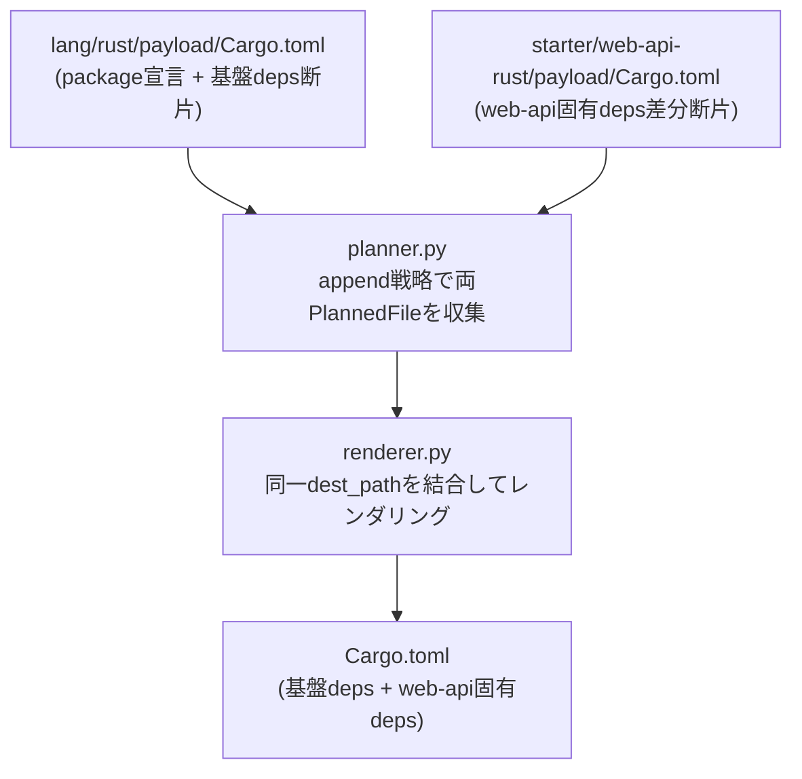
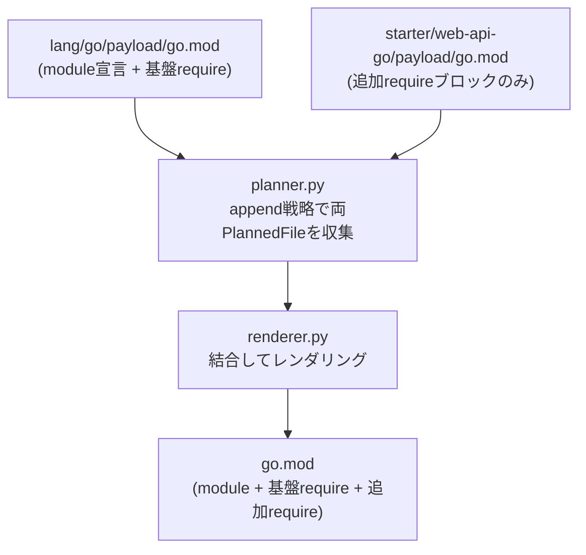

# 設計提案: 言語別package manifestの基盤依存と用途別依存を合成可能にする

状態はfrontmatter(`status`・`proposed_at`・`approved_at`・`approved_by`・`implemented_at`・
`related`)が正本です。

## 目次

- [1. 問題](#1-問題)
- [2. 対象範囲](#2-対象範囲)
- [3. 選択肢](#3-選択肢)
- [4. 設計案](#4-設計案)
- [5. 失敗とロールバック](#5-失敗とロールバック)
- [6. 検証](#6-検証)
- [7. 未解決事項](#7-未解決事項)

## 1. 問題

`lang/rust`、`starter/web-api-rust`、`starter/web-htmx-rust` が `Cargo.toml` の基盤依存を
再掲しています。同様に `lang/go`、`starter/web-api-go` が `go.mod` の基盤依存を再掲して
います。

現状のファイル構成（Cargo.toml）:

| Part | 内容 |
| --- | --- |
| `lang/rust` | `[package]` + `[dependencies]`: `anyhow`, `serde`, `serde_json`, `thiserror`, `tracing`, `tracing-subscriber`（6依存） |
| `starter/web-api-rust` | `lang/rust`の基盤依存全文 + `axum`, `reqwest`, `tokio`（9依存 = 累積スーパーセット） |
| `starter/web-htmx-rust` | `web-api-rust`の全文 + `askama`, `askama_axum`, `tower-http`（12依存 = 累積スーパーセット） |

現状のファイル構成（go.mod）:

| Part | 内容 |
| --- | --- |
| `lang/go` | `module` + `go 1.23` + `require github.com/joho/godotenv v1.5.1` |
| `starter/web-api-go` | `lang/go`の全文 + `github.com/go-chi/chi/v5 v5.1.0`（累積スーパーセット） |

この累積スーパーセット方式の問題点は次の通りです。

- `lang/rust`の基盤依存を変更すると、各starter Partへ手動で反映する必要がある
- 反映漏れを静的に検出できない
- `#98`の starter / foundation / database 拡張で starter が増えるほど、ドリフトリスクが
  増大する

## 2. 対象範囲

| 対象 | 対象外 |
| --- | --- |
| `lang/rust` の `Cargo.toml` を基盤断片として維持し、starter 側を差分断片のみに削減する | `tooling/generator/` の変更（後述の案A採用により不要） |
| `starter/web-api-rust` の `Cargo.toml` を差分断片（web-api固有deps）のみに変更する | `flake.nix` などの他ファイルへの断片合成の横展開 |
| `starter/web-htmx-rust` の `Cargo.toml` を差分断片（htmx固有deps）のみに変更する | `package.json`（TypeScript）への適用（将来Issue） |
| `lang/go` の `go.mod` を基盤断片として維持し、starter 側を差分断片のみに削減する | Go以外の言語への横展開 |
| `starter/web-api-go` の `go.mod` を差分断片（追加`require`ブロック）のみに変更する |  |
| part.toml の strategy を `"replace"` から `"append"` に変更する |  |
| e2eテストを更新して等価性と基盤依存の包含を検証する |  |
| 基盤依存の再掲漏れを検出するテストを追加する |  |

## 3. 選択肢

| 案 | 内容 | 評価 |
| --- | --- | --- |
| A | `append` 戦略を使い、starter 側を差分断片のみに削減する（`tooling/generator/` 変更不要、既に `append` 実装済み） | ← **推奨**。最小変更で実現できる。TOML・go.mod のファイル形式として有効な断片結合が可能 |
| B | 全文replaceを継続し、基盤依存の再掲漏れを検出するテストを追加する | 冗長性は残るが、ドリフトを検出可能にする。案Aより変更が少ない。ただし実装が増えるたびに機械的な再掲が必要 |
| C | 専用のTOML mergeライブラリを追加して依存テーブルをマージする | 依存追加コストが高く、断片結合で十分な効果が得られる本件では過剰設計 |

案Aを採用します。理由は次の通りです。

1. `append` 戦略は issue #134（.gitignore）で既に実装済みであり、新しい依存や設計変更なしに
   使用できます
2. TOML の仕様として、`[dependencies]` セクション宣言の後に key=value を追加記述することは
   有効なTOMLです（`python3 -c 'import tomllib; ...'` で検証済み）
3. `go.mod` の仕様として、複数の `require` ブロックを持つことは有効です（go toolchain で
   自動マージされます）
4. 生成物は現行と等価（同じ依存セット）であることをe2eテストで確認できます

### 3.1. TOML断片結合の妥当性検証

`Cargo.toml` のケース:

```toml
# lang/rust 断片（基盤）
[package]
name = "myproject"
version = "0.1.0"
edition = "2021"

[dependencies]
anyhow = "1"
serde = { version = "1", features = ["derive"] }
...

# starter/web-api-rust 差分断片（追加deps）
axum = "0.8"
reqwest = { version = "0.12", features = ["json"] }
tokio = { version = "1", features = ["full"] }
```

結合後は `[dependencies]` セクションに全依存が含まれる有効なTOMLになります。

`go.mod` のケース:

```text
# lang/go 断片（基盤）
module myproject

go 1.23

require github.com/joho/godotenv v1.5.1

# starter/web-api-go 差分断片（追加require）
require (
    github.com/go-chi/chi/v5 v5.1.0
)
```

複数の `require` ブロックは有効な `go.mod` 形式です。

## 4. 設計案

### 4.1. 基盤依存と用途別依存の所有者

| ファイル | 所有者 | 依存の種別 |
| --- | --- | --- |
| `lang/rust/payload/Cargo.toml` | `lang/rust` Part | `[package]` 宣言 + 基盤依存（anyhow, serde, serde_json, thiserror, tracing, tracing-subscriber） |
| `starter/web-api-rust/payload/Cargo.toml` | `starter/web-api-rust` Part | web-api 固有依存（axum, reqwest, tokio）の差分断片のみ |
| `starter/web-htmx-rust/payload/Cargo.toml` | `starter/web-htmx-rust` Part | htmx 固有依存（axum, askama, askama_axum, reqwest, tokio, tower-http）の差分断片のみ |
| `lang/go/payload/go.mod` | `lang/go` Part | module 宣言 + go バージョン + 基盤依存（godotenv） |
| `starter/web-api-go/payload/go.mod` | `starter/web-api-go` Part | web-api 固有依存（chi）の追加 `require` ブロックのみ |

> [!NOTE]
> `starter/web-htmx-rust` は `starter/web-api-rust` を **requires しない** ため、
> web-api と htmx の両方に必要な deps（axum, reqwest, tokio）は `web-htmx-rust` 差分断片に
> 含める必要があります。将来 `web-api-rust` を requires の対象にすることで重複を解消できますが、
> それは #98 の設計範囲のため、本Issueでは現行の requires 構造を維持します。

### 4.2. 処理フロー（Cargo.toml）



### 4.3. 処理フロー（go.mod）



### 4.4. part.toml の変更

**`lang/rust/part.toml`**: `Cargo.toml` の strategy は `"replace"` のまま変更しません。
lang/rust が最初に処理される Part であり、`append` 戦略の「基盤断片」として機能します。

**`starter/web-api-rust/part.toml`**: `Cargo.toml` の strategy を `"replace"` から
`"append"` に変更します。

**`starter/web-htmx-rust/part.toml`**: `Cargo.toml` の strategy を `"replace"` から
`"append"` に変更します。

**`lang/go/part.toml`**: `go.mod` の strategy は `"replace"` のまま変更しません。

**`starter/web-api-go/part.toml`**: `go.mod` の strategy を `"replace"` から
`"append"` に変更します。

### 4.5. payload ファイルの変更内容

**`starter/web-api-rust/payload/Cargo.toml`** （変更後）:

```toml
axum = "0.8"
reqwest = { version = "0.12", features = ["json"] }
tokio = { version = "1", features = ["full"] }
```

**`starter/web-htmx-rust/payload/Cargo.toml`** （変更後）:

```toml
askama = "0.12"
askama_axum = "0.4"
axum = "0.8"
reqwest = { version = "0.12", features = ["json"] }
tokio = { version = "1", features = ["full"] }
tower-http = { version = "0.6", features = ["fs"] }
```

**`starter/web-api-go/payload/go.mod`** （変更後）:

```text
require (
	github.com/go-chi/chi/v5 v5.1.0
)
```

## 5. 失敗とロールバック

- `lang/rust` および `lang/go` の基盤断片は変更しないため、lang単体生成物は現行と同一（回帰なし）
- starter 側の差分断片は「`append` 結合後の生成物が現行と等価」の前提に依存するため、
  e2eテストで等価性を確認してからコミットする
- `append` 戦略の `PlannedFile` が複数ある場合のみ新しいコードパスを通る。既存の
  `error`/`replace`/`add` 戦略は変更なし
- ロールバックは `git revert` で可能
- `test_files_rules_match_payload_paths` が差分断片ファイルの存在を検証するため、
  payload ファイルの削除漏れは自動検出される

## 6. 検証

| テスト層 | 検証内容 |
| --- | --- |
| `tests/unit/test_payload.py::test_files_rules_match_payload_paths` | 差分断片ファイルが `[[files]].path` に対応する実ファイルとして存在すること |
| `tests/e2e/test_generate_profiles.py` | `starter-web-api` + `lang=rust` 生成時に基盤deps（tracing, serde等）と web-api deps（axum, tokio, reqwest）が両方 `Cargo.toml` に含まれること（等価性確認） |
| `tests/e2e/test_generate_profiles.py` | `starter-web-htmx` + `lang=rust` 生成時に基盤deps と htmx固有deps（askama, tower-http等）が両方 `Cargo.toml` に含まれること |
| `tests/e2e/test_generate_profiles.py` | `starter-web-api` + `lang=go` 生成時に基盤dep（godotenv）と chi が両方 `go.mod` に含まれること |
| `tests/unit/test_payload.py` (新規) | `starter/web-api-rust` の `Cargo.toml` 差分断片に `[package]` / `[dependencies]` ヘッダが含まれないこと（再掲漏れ検出） |
| `tests/unit/test_payload.py` (新規) | `starter/web-htmx-rust` の `Cargo.toml` 差分断片に `[package]` / `[dependencies]` ヘッダが含まれないこと |
| `tests/unit/test_payload.py` (新規) | `starter/web-api-go` の `go.mod` 差分断片に `module` / `go` 宣言が含まれないこと |
| `just verify` | 全チェック pass |

## 7. 未解決事項

- **`web-htmx-rust` の web-api 依存重複**: `web-htmx-rust` は `web-api-rust` を
  requires しないため、`axum`, `reqwest`, `tokio` が `web-htmx-rust` 差分断片に再掲
  されます。これは #98 の requires 構造再設計で解消する予定です
- **TypeScript `package.json` への適用**: `package.json` は JSON 形式であり、
  単純な行 append では無効な JSON になります。将来 TypeScript starter が増えた時点で
  専用の設計を行います
- **`go.sum` ファイル**: `go.sum` は `go mod tidy` で自動生成されるため、template Part
  には含めません。これは現行と変わりません
- **`append` 結合時の区切り**: `renderer.py` は現在、断片間を空行で結合します。
  TOML / go.mod の文法上これは問題ありませんが、生成物のフォーマットが `go mod tidy`
  等で整形されることを想定します
