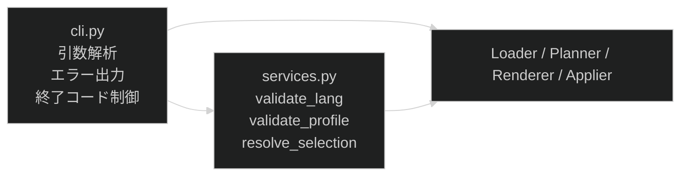

# 設計提案: generatorの選択・preflight処理をCLIから分離する

状態はfrontmatter(`status`・`proposed_at`・`approved_at`・`approved_by`・`implemented_at`・
`related`)が正本です。

## 目次

- [1. 問題](#1-問題)
- [2. 対象範囲](#2-対象範囲)
- [3. 選択肢](#3-選択肢)
- [4. 設計案](#4-設計案)
  - [4.1. 新モジュール: services.py](#41-新モジュール-servicespy)
  - [4.2. 責務の移動マップ](#42-責務の移動マップ)
  - [4.3. 公開インターフェース](#43-公開インターフェース)
  - [4.4. cli.py の変更後構成](#44-clipy-の変更後構成)
- [5. 失敗とロールバック](#5-失敗とロールバック)
- [6. 検証](#6-検証)
- [7. 未解決事項](#7-未解決事項)

## 1. 問題

`tooling/generator/cli.py` が引数解析以外のビジネスロジックを複数抱えています。

| # | 問題 | 現在地 |
| --- | ------ | -------- |
| P-1 | lang/profile の検証ロジックが `_cmd_generate` と `_cmd_create` に二重実装されています | `cli.py:73-90`, `cli.py:304-320` |
| P-2 | lang companion Part の選択ロジック(`_starter_lang_parts`)が CLI 内部関数として定義されており、wizard経路から直接呼べません | `cli.py:93-103` |
| P-3 | profile のロード・拡張（lang Part + companion Part の結合）が `_do_generate` 内に混在しています | `cli.py:123-136` |
| P-4 | `generate` と `create` で同じ preflight(lang/profile 検証)を通ることが保証されていません | `_cmd_generate:287-293`, `_cmd_create:333-347` |

`docs/architecture/core.md` の責務定義では `cli.py` の責務は「引数解析・LangSpec生成・lang Parts注入・エラー出力・終了コード制御」とされていますが、現状は「lang Parts 注入」と「LangSpec生成」の判断ロジックが CLI 層に残っています。

## 2. 対象範囲

| 対象 | 対象外 |
| --- | --- |
| `_validate_lang` / `_validate_profile` の共通化 | wizard の UI ロジック(`wizard.py`) |
| `_starter_lang_parts` の CLI 外移動 | `planner.py` / `resolver.py` / `applier.py` の変更 |
| `_do_generate` 内の profile 拡張ロジックの抽出 | manifest、workspace、inject サブコマンドの変更 |
| `_cmd_generate` と `_cmd_create` が同一の preflight を通る保証 | Go移行対応(#112) |
| `docs/architecture/core.md` の責務表更新 |  |

## 3. 選択肢

| 案 | 内容 | 評価 |
| --- | --- | --- |
| A | `services.py` に選択・preflight を集約する | 推奨。責務が明確な1モジュールで完結します |
| B | `selection.py` と `preflight.py` を分離する | 過剰分割。このスコープでは1ファイルで十分です |
| C | `cli.py` 内でヘルパーを整理するだけ | 問題の根本(重複・CLI依存)が残ります |

案 A を採用します。

## 4. 設計案

### 4.1. 新モジュール: services.py

`tooling/generator/services.py` を新設します。責務は「selection(profile/lang の解決・拡張) と preflight(事前検証)を CLI から独立した形で提供する」です。

```python
# tooling/generator/services.py

from __future__ import annotations

from dataclasses import dataclass
from pathlib import Path

from template.schema.profile_schema import ProfileSchema
from tooling.generator.errors import LoadError
from tooling.generator.loader import load_profile
from tooling.generator.models import LangSpec


@dataclass(frozen=True)
class SelectionResult:
    """profile 拡張の結果。lang companion Parts を含む拡張済み ProfileSchema を保持します。"""
    extended_profile: ProfileSchema
    lang_spec: LangSpec | None


def validate_lang(lang_value: str, available: list[str]) -> tuple[LangSpec | None, str | None]:
    """lang 値を検証し (LangSpec, None) か (None, error_msg) を返します。"""
    ...


def validate_profile(profile: str, available: list[str]) -> str | None:
    """profile 値を検証し、不正な場合はエラーメッセージを返します。"""
    ...


def resolve_selection(
    profile_id: str,
    lang: str | None,
    template_root: Path,
) -> SelectionResult:
    """profile をロードし、lang companion Parts を付加した拡張 ProfileSchema を返します。

    `cli.py::_do_generate` 内の profile 拡張ロジックを移植します。
    `generate` コマンドと `create` コマンドの双方から呼び出し可能です。
    LoadError を raise した場合は呼び出し元がエラー出力します。
    """
    ...
```

### 4.2. 責務の移動マップ

| 移動前 (cli.py) | 移動後 |
| --- | --- |
| `_validate_lang(lang_value, available)` | `services.validate_lang` |
| `_validate_profile(profile, available)` | `services.validate_profile` |
| `_starter_lang_parts(profile_parts, lang, template_root)` | `services.resolve_selection` の内部実装 |
| `_do_generate` 内の profile ロード・拡張ブロック(L123-136) | `services.resolve_selection` |

`cli.py` に残るもの: 引数解析、`_resolve_output_path`、`_validate_name`、`_parse_role`、`_write_role_readme`、`_generate_roles`、`_do_generate`(services を呼ぶように修正)、各 `_cmd_*` 関数、`main`。

### 4.3. 公開インターフェース

```python
# 呼び出し元の変更イメージ

# _cmd_generate から (langを検証済みとして)
result = services.resolve_selection(args.profile, args.lang, TEMPLATE_ROOT)
# result.extended_profile, result.lang_spec を _do_generate へ渡す

# _cmd_create から (wizard後)
result = services.resolve_selection(answers.profile, answers.lang, TEMPLATE_ROOT)
```

`_do_generate` は `extended_profile` と `lang_spec` を引数として受け取る形へ変更します。
これにより profile の拡張判断が CLI 外で完結し、`create` 経路でも同じ拡張ロジックが適用されます。

### 4.4. cli.py の変更後構成



`wizard.py` は `services.py` を呼ばず、呼び出し元 (`_cmd_create`) が wizard 結果を受けて `services.resolve_selection` を呼びます。`services.py` は `wizard.py` に依存しません。

## 5. 失敗とロールバック

| ケース | 現在の挙動 | 変更後の挙動 |
| --- | --- | --- |
| 不正な lang | `_validate_lang` がエラー文字列を返す | `services.validate_lang` が同じシグネチャで返す |
| 不正な profile | `_validate_profile` がエラー文字列を返す | `services.validate_profile` が同じシグネチャで返す |
| profile LoadError | `_do_generate` 内で catch | `resolve_selection` が raise し、呼び出し元が catch |
| generate/create の出力・終了コード | 変更なし | 変更なし |

`generate` と `create` の CLI 出力・終了コードは変更しません。既存の互換性テストはすべて通過する必要があります。

## 6. 検証

| 層 | 検証内容 |
| --- | --- |
| unit (`test_generator.py`) | `services.validate_lang` / `validate_profile` / `resolve_selection` を直接テスト。既存 CLI 統合テストはそのまま通過します |
| e2e (`test_generate_profiles.py`) | 全テストが変更なしで通過します(出力・終了コードの互換性確認) |
| `just verify` | formatter / linter / 全テストが通過します |

テスト追加方針:

- `validate_lang` の正常系・異常系
- `validate_profile` の正常系・異常系
- `resolve_selection` が lang companion Part を正しく拡張することの確認
- `generate` と `create` が同じ `resolve_selection` を経由して同一 preflight を通ることの確認

## 7. 未解決事項

| ID | 論点 | 対応 |
| --- | --- | --- |
| U-1 | `_generate_roles` 内の lang/profile 検証は今回の範囲内で services へ移動するか | 移動します(`_cmd_generate` が `--role` 時に使う `_validate_profile` / `_validate_lang` も services へ) |
| U-2 | `services.py` の単体テストを `test_generator.py` に追記するか別ファイルにするか | 既存 `test_generator.py` に追記します(ファイル新設はこのスコープには過剰です) |
