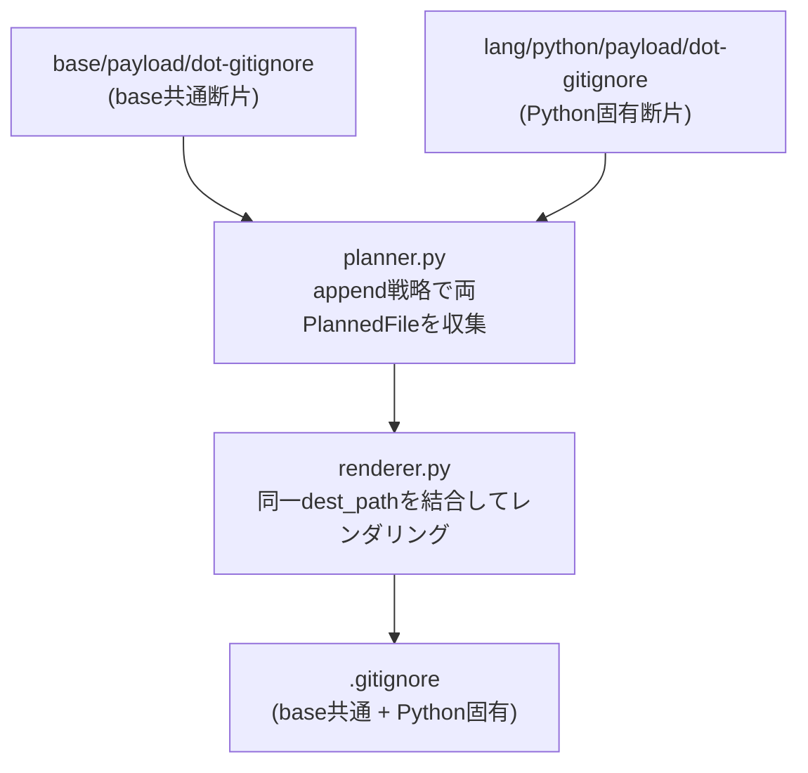

# 設計提案: baseと言語別の.gitignoreを断片から合成する

状態はfrontmatter(`status`・`proposed_at`・`approved_at`・`approved_by`・`implemented_at`・
`related`)が正本です。

## 目次

- [1. 問題](#1-問題)
- [2. 対象範囲](#2-対象範囲)
- [3. 選択肢](#3-選択肢)
- [4. 設計案](#4-設計案)
- [5. 失敗とロールバック](#5-失敗とロールバック)
- [6. 検証](#6-検証)
- [7. 未解決事項](#7-未解決事項)

## 1. 問題

`template/parts/base/payload/dot-gitignore`（base共通）と各
`template/parts/lang/*/payload/dot-gitignore`（lang固有）は、**base全文をlang側に複製**する
構造になっています。

現状のファイル構成:

| Part | 内容 |
| --- | --- |
| `base` | 共通ignore（16行） |
| `lang/python` | base全文（16行）+ Python固有（4行）= 20行 |
| `lang/typescript` | base全文（16行）+ TS固有（3行）= 19行 |
| `lang/rust` | base全文（16行）+ Rust固有（3行）= 19行 |
| `lang/go` | base全文（16行）+ Go固有（9行）= 25行 |

この複製構造の問題点は次の通りです。

- `base`の共通ignoreを変更すると、各`lang/*/payload/dot-gitignore`へ手動で反映する必要がある
- 変更漏れが静的には検出できない
- `tmp/audit/2026-07-22-parts-redundancy-report.md`で「行結合が意味を持ちやすく、
  専用mergeまたは断片合成を検討」と評価されている

過去（issue #89）では`append`戦略を追加することが検討されましたが、「単一ユースケースに
対する過剰投資」として見送られました。しかし当時との違いとして、issue #94 により
`base`はlang非依存化されており、現在のbase断片は「全ての生成プロジェクトに必要な内容」を
正確に表しています。断片合成に移行する前提条件が整った状況です。

## 2. 対象範囲

| 対象 | 対象外 |
| --- | --- |
| `base`の`dot-gitignore`をそのまま維持しつつ、`lang/*`側を「lang固有断片のみ」に削減する | `planner.py`・`renderer.py`の変更（後述の案A採用により不要） |
| `lang/*/part.toml`の`.gitignore`戦略を`"replace"`から`"append"`に変更する | 新しいfile_rules戦略の追加（案A採用により不要） |
| `lang/*`の`dot-gitignore`をlang固有部分のみに削減する | `flake.nix`や`Cargo.toml`などの他ファイルの断片合成 |
| e2eテストを更新して重複行がないことを検証する | `lang/go`以外のlang追加（現在のlang/goは既に実装済み） |

## 3. 選択肢

| 案 | 内容 | 評価 |
| --- | --- | --- |
| A | `lang/*/part.toml`の`.gitignore`エントリを`strategy="append"`に変更し、`lang/*/payload/dot-gitignore`をlang固有断片のみに削減する（`planner.py`の既存`"add"`戦略を`"append"`に拡張） | ← **推奨**。`planner.py`に`"append"`戦略を追加する最小限の変更で実現できる。断片の所有者が分かれ、変更漏れが機械的に防止される |
| B | `lang/*`の`dot-gitignore`を`strategy="replace"`のまま維持しつつ、`planner.py`に`"gitignore-merge"`専用戦略を追加してbaseとlangを合成する | 実装が複雑で、専用戦略として`.gitignore`以外のユースケースがない。過剰設計 |
| C | 現状維持（`strategy="replace"`で全文複製） | 変更漏れリスクが続く。issue #134の目的に反する |

案Aを採用します。

### 3.1. 案Aにおける`append`戦略の設計

`planner.py`に新しい`"append"`戦略を追加します。

```text
append戦略:
  - 最初のPartが提供するファイルをbaseとして保持する
  - 後続Partが同じdest_pathに"append"戦略で提供する場合、両方のファイルをPlannedFileリストに追加する
  - renderer.pyでは、同一dest_pathに複数のPlannedFileがある場合、内容を順に結合して出力する
```

`renderer.py`の現行実装は`PlannedFile`を1対1で処理するため、複数ファイルを結合する
拡張が必要です。

### 3.2. 実装の詳細

**`tooling/generator/models.py`**

`PlannedFile`の`strategy`フィールドに`"append"`が追加されます（スキーマ変更は不要）。

**`tooling/generator/planner.py`**

```python
# 現行: append→add扱いで先行ファイルを維持するのみ
elif strategy == "add":
    pass  # keep first part's version

# 変更後: appendは複数PlannedFileを蓄積する
elif strategy == "append":
    planned_append.setdefault(dest, []).append(
        PlannedFile(src_path=src, dest_path=dest, strategy=strategy)
    )
```

`planned`（dict）とは別に`planned_append`（list of lists）を管理し、
`GenerationPlan.files`構築時に、`"append"`対象のdest_pathは全断片を収める
`AppendedFile`（新データクラス）またはソート済みリストとして表現します。

> [!NOTE]
> 実装の最小変更を優先するため、`PlannedFile`に`"append"`戦略のエントリが複数現れる
> 場合を`renderer.py`が処理できる形にします。最もシンプルな方法は、`GenerationPlan.files`
> に同一`dest_path`の`PlannedFile`が複数現れることを許容し、`renderer.py`がそれらを
> 検出して結合することです。

**`tooling/generator/renderer.py`**

```python
def render(plan: GenerationPlan, staging_dir: Path) -> None:
    # dest_pathでグループ化
    groups: dict[str, list[PlannedFile]] = {}
    for pfile in plan.files:
        groups.setdefault(pfile.dest_path, []).append(pfile)

    for dest_path, pfiles in groups.items():
        if len(pfiles) == 1:
            _render_file(pfiles[0].src_path, dest_path, plan.variables, staging_dir)
        else:
            # append: 全断片を結合（改行で区切る）
            _render_appended_files(pfiles, dest_path, plan.variables, staging_dir)
```

**`template/parts/lang/*/payload/dot-gitignore`**

base共通部分を除去し、lang固有断片のみに変更します。

`lang/python/payload/dot-gitignore`の変更例:

```gitignore
# === Python ===
__pycache__/
*.pyc
```

`lang/typescript/payload/dot-gitignore`の変更例:

```gitignore
# === Node.js / TypeScript ===
node_modules/
```

**`template/parts/lang/*/part.toml`**

`.gitignore`エントリの`strategy`を`"replace"`から`"append"`に変更します。

**`template/schema/part_schema.py`**

`STRATEGIES`タプルに`"append"`を追加します。

```python
STRATEGIES = ("error", "replace", "add", "append")
```

## 4. 設計案

### 4.1. 処理フロー



### 4.2. 責任の分離

| ファイル | 責任 |
| --- | --- |
| `base/payload/dot-gitignore` | 全プロジェクト共通のignoreエントリ（言語非依存）の所有者 |
| `lang/*/payload/dot-gitignore` | lang固有のignoreエントリの所有者 |
| `lang/*/part.toml` | `append`戦略でbaseとの結合を宣言 |
| `planner.py` | `append`戦略を処理し、同一dest_pathの複数PlannedFileを収集 |
| `renderer.py` | 同一dest_pathの複数PlannedFileを改行で結合してレンダリング |

### 4.3. `--lang`省略時の動作

`--lang`省略時はlang Partが注入されないため、`base/payload/dot-gitignore`のみが
`GenerationPlan`に含まれます。`renderer.py`は単一ファイルをそのままレンダリングします。
完了条件「`--lang`省略時はbase共通のみ生成される」を満たします。

### 4.4. 重複行防止

各`lang/*/payload/dot-gitignore`からbase共通行を除去することで、結合後の重複行が
構造的に発生しなくなります。e2eテストで「lang側のdot-gitignoreにbase共通行が含まれない
こと」を検証します（後述）。

### 4.5. スキーマ変更

`template/schema/part_schema.py`の`STRATEGIES`に`"append"`を追加します。
`template/schema/part_schema.py`の既存`_validate_file_rule`がバリデーションを担うため、
追加のバリデーションロジックは不要です。

## 5. 失敗とロールバック

- `base`の内容は変更しないため、`--lang`省略生成物は現行と同一（回帰なし）
- lang側から base共通行を削除する変更は「`append`結合後の生成物が現行と等価」の前提に
  依存するため、e2eテストで等価性を確認してからコミットする
- `append`戦略の`PlannedFile`が複数ある場合にのみ新しいコードパスを通る。既存の
  `error`/`replace`/`add`戦略は変更なし
- ロールバックは`git revert`で可能
- `planner.py`の変更が不正な場合、PlanErrorをraiseして早期に失敗する（既存のエラー
  ハンドリングパターンを踏襲）

## 6. 検証

| テスト層 | 検証内容 |
| --- | --- |
| `tests/unit/test_generator.py` | `append`戦略で2つのPartを処理した場合、生成物に両断片が含まれる単体テスト |
| `tests/unit/test_generator.py` | `--lang`省略時に`base`のみが含まれること（単体テスト） |
| `tests/unit/test_schema.py` | `"append"`が有効なstrategyとして受理されること |
| `tests/e2e/test_generate_profiles.py` | 各langで生成した`.gitignore`がbase共通行を含むこと（等価性確認） |
| `tests/e2e/test_generate_profiles.py` | 各langで生成した`.gitignore`に重複行がないこと（新規追加） |
| `tests/e2e/test_generate_profiles.py` | `--lang`省略時に`.gitignore`がlang固有行を含まないこと |
| `just verify` | 全チェックpass |

## 7. 未解決事項

- **`planner.py`のデータ構造**: `GenerationPlan.files`に同一`dest_path`のエントリを
  複数許容するか、`AppendedFile`など別の表現を使うかは実装フェーズで確定する。どちらも
  `renderer.py`の変更は同等の規模のため、実装者が最もテストしやすい表現を選ぶ
- **区切り文字**: base断片とlang断片を結合する際の区切り（改行1行 vs 空行）は、
  既存の各`dot-gitignore`のフォーマットに合わせて空行1行で統一する
- **`flake.nix`等への横展開**: `append`戦略は.gitignore以外にも使える汎用機構だが、
  `flake.nix`への適用は可読性トレードオフがあり別Issue判断とする
- **`"add"`戦略との関係**: `"add"`（先行Partのファイルを保持）と`"append"`（全断片を
  結合）は異なる意味で、名前の混乱を避けるためコードコメントで区別を明示する
