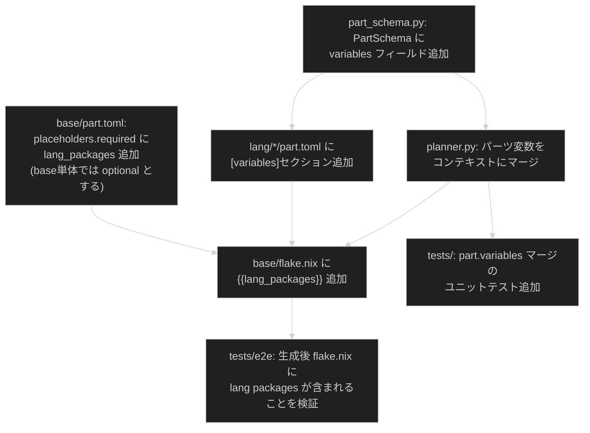

# 設計提案: lang別flake.nixの共通化可否を設計判断する

状態はfrontmatter(`status`・`proposed_at`・`approved_at`・`approved_by`・`implemented_at`・
`related`)が正本です。

## 目次

- [1. 問題](#1-問題)
- [2. 対象範囲](#2-対象範囲)
- [3. 選択肢](#3-選択肢)
- [4. 設計案](#4-設計案)
- [5. 失敗とロールバック](#5-失敗とロールバック)
- [6. 検証](#6-検証)
- [7. 未解決事項](#7-未解決事項)

## 1. 問題

`template/parts/base/payload/flake.nix` と `template/parts/lang/{go,python,rust,typescript}/payload/flake.nix` の5ファイルは、100〜111行のほぼ同一構造を持ちます。コメント・空白行を除いた実質的な差分は `devShell.packages` リストの内容のみです（hooks定義・inputs・forAllSystems・treefmtEval は5ファイルで完全に同一）。

`features/github-rulesets` のような共通ツールをbaseに追加する際、lang側4ファイルへの反映漏れが起きやすい保守リスクがあります。

Issue #97（justfile/treefmt.nix共通化）では「flake.nixは可読性トレードオフがあり別途PM判断が必要」として意図的に除外されました。本Issueはその継続判断です。

## 2. 対象範囲

| 対象 | 対象外 |
| --- | --- |
| `base`と`lang/*`の`flake.nix`共通化方針の決定とADR記録 | `features/*`のflake.nixへのインジェクション(現在flake.nixを持つfeaturesパーツなし) |
| `base/flake.nix`への`{{lang_packages}}`プレースホルダー導入 | `features/github-rulesets`がflake devShellへpackagesを追加する仕組み(別Issue) |
| `lang/*/part.toml`への`[variables]`セクション追加(ジェネレータ拡張が必要な場合) | flake.lockの更新方針 |
| `tests/e2e/test_generate_profiles.py`のflake内容検証 | Nixの評価・`nix build`のCI化(Nixインストール不要環境での検証は対象外) |

## 3. 選択肢

調査で確認した差分の実態と issue-97 設計文書の先行分析、およびジェネレータの変数機構の調査を踏まえ、4案を評価します。

| 案 | 内容 | 評価 |
| --- | --- | --- |
| A | `flake-lib.nix`で共通ボイラープレートを関数化し、各`flake.nix`は`extraPackages`を渡すだけにする | 保守コスト最小。ただし生成後プロジェクトの`flake.nix`が単体では読めず、`flake-lib.nix`を開く必要がある。issue-97で技術的実現可能と確認済み |
| B | 現状維持のうえ、ドリフト検出テストを追加して反映漏れをCIで検知する | `flake.nix`の可読性を最大限保つ。ドリフトはテストで早期検出できる。実装はシンプルで生成物が自己完結する |
| C | ジェネレータ側で`flake.nix`を動的生成(packages一覧をprofile定義から合成)する | 保守コスト最小かつ可読性も維持できるが、ジェネレータへの大規模変更が必要で本Issueのスコープ外 |
| **X** | **`base/flake.nix`に`{{lang_packages}}`プレースホルダーを置き、lang partが変数値を提供する** | **生成後`flake.nix`が自己完結。`base`が1つの正本になり保守コストが下がる。ジェネレータへの中規模変更が必要(後述)** |

### 推奨案

**案X** を選択します（PMが選択）。

案Bのドリフト検出アプローチは「テストが落ちて初めて気づく」受動的な保守であり、5ファイルの重複自体は解消されません。案Xは`base/flake.nix`を唯一の正本とし、lang固有のpackages定義のみを各langパーツが宣言する方式で、保守コストと可読性の両立を実現します。案Aの`flake-lib.nix`依存とは異なり、生成後ファイルは完全な自己完結型`flake.nix`として出力されます。

## 4. 設計案

### 4.1. ジェネレータ変数機構の現状分析

現状のジェネレータは以下の変数フロー持ちます:

```text
profile.toml [variables] セクション
  → ProfileSchema.variables (Mapping[str,str])
  → plan() の profile_variables 引数
  → GenerationPlan.variables (dict[str,str])
  → renderer: {{var}} を文字列で置換
```

`{{lang_packages}}`を実現するために必要な変数の提供元として、2つのサブ案があります。

#### サブ案 X-A: プロファイル側で `lang_packages` を定義する

各 `template/profiles/*.toml` の `[variables]` セクションに `lang_packages` を追加します。

```toml
# template/profiles/starter-cli.toml (lang=python を想定する例)
[variables]
lang_packages = "pkgs.python3\n              pkgs.python3Packages.pytest\n              pkgs.ruff\n              pkgs.uv"
```

- **ジェネレータ変更: 不要**（既存の変数機構がそのまま動く）
- **欠点**: パッケージリストがパーツではなくプロファイルに分散する。langパーツとプロファイルの間で定義が重複しやすい。`--lang` CLI フラグ経由で lang パーツを動的に追加する現在の仕組みとの整合性が取りにくい

#### サブ案 X-B: `part.toml` に `[variables]` セクションを追加する

`lang/*/part.toml` に `[variables]` セクションを導入し、パーツが変数値を提供できるようにします。

```toml
# template/parts/lang/python/part.toml
[variables]
lang_packages = """
              pkgs.python3
              pkgs.python3Packages.pytest
              pkgs.ruff
              pkgs.uv"""
```

ジェネレータ側変更:

1. **`template/schema/part_schema.py`**: `PartSchema` に `variables: Mapping[str, str]` フィールドを追加。`validate_part()` で `[variables]` テーブルを読み取り・型検証する
2. **`tooling/generator/planner.py`**: `plan()` 内でパーツをループする際、`part.variables` をコンテキストにマージする。マージ順はパーツ順（later parts override earlier、ただし `_RESERVED` キーは不変）。同一キーの衝突時は `PlanError` を上げるかオーバーライドするかをポリシーとして決定する必要あり

- **ジェネレータ変更: 中規模**（`part_schema.py` +約20行、`planner.py` +約10行）
- **利点**: langパーツが自分のpackages定義を持つ責任分離が明確。`--lang python` 動的追加でも変数が自動的にコンテキストへ入る

### 4.2. 推奨サブ案

**サブ案 X-B** を選択します。

サブ案X-Aはジェネレータ変更なしで実現できますが、「langパーツが自分の責任を持つ」という設計原則に反し、プロファイルにパッケージリストが散在します。特に `--lang` CLI フラグ経由の動的lang追加では `lang_packages` 変数がコンテキストに注入されず、`{{lang_packages}}`未解決エラーが発生します。サブ案X-Bはジェネレータへの中規模変更が必要ですが、責任の場所が正しく、`--lang` 動的追加でも自然に機能します。

### 4.3. 実装計画



実装ステップ（依存の浅い順）:

1. `template/schema/part_schema.py`: `PartSchema.variables` フィールド追加・`validate_part()` で `[variables]` 読み取り
2. `tooling/generator/planner.py`: パーツ変数マージロジック追加（profile_variables → part variables → reserved の優先順）
3. `template/parts/base/payload/flake.nix`: `{{lang_packages}}` プレースホルダー導入。`pkgs.gh` / `pkgs.jq` は base 固有として残す
4. `template/parts/base/part.toml`: `lang_packages` を `placeholders.optional`（または base 単体生成用のデフォルト値）として記述する方針を決定
5. `template/parts/lang/*/part.toml`: `[variables] lang_packages = "..."` 追加（go / python / rust / typescript 各4ファイル）
6. lang の `payload/flake.nix` 4ファイルを削除（base の flake.nix が唯一の正本になる。langの `[[files]]` から `flake.nix` エントリを削除）
7. `tests/unit/`: `planner` のパーツ変数マージのユニットテスト追加
8. `tests/e2e/test_generate_profiles.py`: 生成後 `flake.nix` にlang固有packages（go/python3/cargo等）が含まれることを検証

### 4.4. base 単体生成時の `{{lang_packages}}` 処理

`base` パーツのみでプロファイルを生成する場合（langなし）、`{{lang_packages}}` が未解決になります。対処方法:

**採用案**: `lang_packages` を `base/part.toml` の `[variables]` セクションでデフォルト値（空文字列または空リストコメント）として定義する。lang パーツがある場合はその定義が後から上書きする

```toml
# template/parts/base/part.toml に追加
[variables]
lang_packages = ""  # lang パーツが上書きする
```

これにより `base` 単体のプロファイルでも `flake.nix` が正しく生成されます（packagesリストに空行が入るが、Nix的に問題なし。整形は別途検討）。

### 4.5. スコープ判定

ジェネレータ変更（ステップ1・2）は約30〜50行規模です。`part_schema.py` と `planner.py` の変更は限定的であり、既存の `profile_variables` 機構の自然な拡張です。本 Issue #135 のスコープに含める判断とします。

| 変更ファイル | 変更規模 | 備考 |
| --- | --- | --- |
| `template/schema/part_schema.py` | +20行 | `PartSchema` フィールド追加、バリデーション |
| `tooling/generator/planner.py` | +10行 | パーツ変数マージ |
| `template/parts/base/payload/flake.nix` | 1行変更 | `{{lang_packages}}` 挿入 |
| `template/parts/base/part.toml` | +3行 | `[variables]` デフォルト値 |
| `template/parts/lang/*/part.toml` (×4) | 各+3行 | `[variables] lang_packages` |
| `template/parts/lang/*/payload/flake.nix` (×4) | 削除 | base が唯一の正本に |
| `template/parts/lang/*/part.toml` (×4) | `[[files]] flake.nix` エントリ削除 | strategy="replace" 不要に |
| `tests/unit/` | +20行 | planner パーツ変数マージのテスト |
| `tests/e2e/` | 既存テスト更新 | lang packages 検証 |

## 5. 失敗とロールバック

| 失敗ケース | 検出 | 対応 |
| --- | --- | --- |
| `{{lang_packages}}` が未解決のまま生成される | `RenderError` がCLIで即時報告 | `part.toml` の `[variables]` または `part_schema.py` のマージロジックを確認 |
| lang パーツ間で `lang_packages` キーが衝突 | `PlanError` を上げるポリシーを採用した場合に検出 | 実装時に衝突ポリシーを「後勝ち」とするかエラーにするかを決定 |
| base 単体プロファイルで packages リストに空行が残る | e2e テストまたは手動確認 | `lang_packages` デフォルト値の整形を調整（先頭・末尾の空白を trim する renderer 拡張、または Nix inline コメントで整形） |
| 既存 e2e テストの `flake.nix` アサーション失敗 | CI test 失敗 | テスト内容を新しい生成結果に合わせて更新 |

ロールバック手順: `base/flake.nix` の `{{lang_packages}}` を元のパッケージリストに戻し、lang の `payload/flake.nix` を復元する。ジェネレータ変更は後方互換なので、ロールバック前のプロファイルでも動作する。

## 6. 検証

| 層 | 検証内容 | ツール |
| --- | --- | --- |
| ユニット | `PartSchema.variables` のバリデーション(正常系・型エラー・予約キー衝突) | `pytest tests/unit/` |
| ユニット | `plan()` のパーツ変数マージ順(profile → part → reserved) | `pytest tests/unit/test_planner.py` |
| e2e | `--lang python` 生成後 `flake.nix` に `pkgs.python3` 等が含まれる | `pytest tests/e2e/test_generate_profiles.py` |
| e2e | lang なしプロファイル生成で `{{lang_packages}}` が未解決エラーにならない | `pytest tests/e2e/test_generate_profiles.py` |
| 文書整合 | frontmatter status が `approved`→`implemented` へ遷移する | `just verify` |

Nixの実際のビルド検証(`nix build`)はNixインストール環境がなければ実行できないため対象外とします。

## 7. 未解決事項

- **`lang_packages` の衝突ポリシー**: 複数パーツが同一キーを定義した場合、後勝ち(override)にするかエラー(`PlanError`)にするかは実装時に決定します。現状 lang パーツは相互 `conflicts` 指定されているため実際の衝突は起きませんが、ポリシーを明示します
- **packages リスト整形**: `{{lang_packages}}` が空文字列の場合、Nix packages リストに余分な空行が残る可能性があります。実装時に renderer レベルの整形または Nix コメント行による回避を検討します
- **`placeholders.required` の扱い変更**: 現状 `lang_packages` は `[variables]` デフォルト値で提供されるため `placeholders.required` に追加しません。将来 base 単体でデフォルト値なしにする場合は `required` 追加が必要です
- **`features/*`がdevShellにpackagesを追加する仕組み**: 現状、featuresパーツはflake.nixを持たずpackagesの注入手段がない。`github-rulesets`が共通ツールを追加したい場合の設計は別Issueとします。本案X-Bのパーツ変数機構は将来 features パーツが `feature_packages` 変数を注入する拡張の基盤にもなりえます
