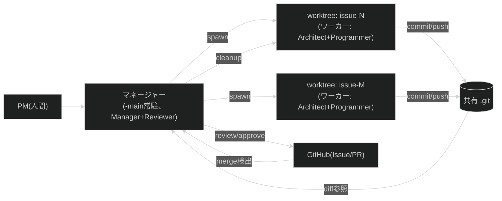

# 設計提案: 並列worktree運用とマネージャー/ワーカー分離の仕組みを定める

状態はfrontmatter(`status`・`proposed_at`・`approved_at`・`approved_by`・`implemented_at`・
`related`)が正本です。

## 目次

- [1. 問題と望ましい結果](#1-問題と望ましい結果)
- [2. 対象範囲](#2-対象範囲)
- [3. ユーザーワークフロー](#3-ユーザーワークフロー)
- [4. システム構成と責任分担](#4-システム構成と責任分担)
- [5. 主要な決定](#5-主要な決定)
- [6. 失敗時と運用](#6-失敗時と運用)
- [7. テスト戦略と受け入れ基準](#7-テスト戦略と受け入れ基準)
- [8. 実装と移行計画](#8-実装と移行計画)
- [9. 未解決事項](#9-未解決事項)

## 1. 問題と望ましい結果

Issueが溜まってきており、PM(人間)と複数のAIエージェント(Claude Code・Codex)が
同時に複数issueへ取り組む必要が出てきました。Issue #98と#123では、`main`用worktreeの
兄弟ディレクトリへissue用worktreeを作り、別のAIエージェントへ作業を委譲する運用を
試験し、有効性を確認しました。

一方、この運用は場当たり的で、以下が未整備のまま進めてしまいました。

- worktree名がツール名ベース(`_template-codex`・`template-claude`)になっており、
  同じツールで2並列したい場合に破綻します
- どのworktreeが何のissue・どのツール担当・どのフェーズかを一元管理する場所がありません
- worktree削除時に未追跡ファイルやsquash merge由来のbranch削除で複数回つまずきました

望ましい結果は、`_template-main`に常駐するマネージャー(Claude・Codexいずれでも可)が、
兄弟ディレクトリのworktreeで動く複数のワーカーを一元的に把握・レビュー・後片付けできる
状態です。ツールを問わず同じ手順が通用することを成功条件とします。

## 2. 対象範囲

| 対象 | 対象外 |
| --- | --- |
| worktree命名規則と中央レジストリ(`tmp/worktrees.json`)の定義 | クロスマシン・分散環境でのworktree共有 |
| マネージャーの運用手順(ツール非依存なprose instructions) | GitHub Actions等CI上での自動レビュー |
| cleanup(人間トリガー・外部スケジューラーからの定期呼び出し)の契約 | スケジューラー自体の作成・常駐プロセスの実装 |
| 同時実行数ガードレールの追加 | UI・ダッシュボードの構築(状態はCLI・ファイルベースで確認する) |
| Role(Manager/Reviewer/Architect/Programmer)の物理配置の明文化 | `.agents/`・`.codex/agents/`が繰り返し再出現する根本原因の特定(別Issueで扱います) |
| `agent-workflow/commands/plan/issue.md`の実装(worktree作成込み) | 既存フェーズ定義(`workflows.md`2節)自体の変更 |
| 決定論的なworktree safety helperとBatsテスト | PM承認の代替、remote branch操作 |
| cleanup時のGitHub PR read検証 | GitHub Issue/PRの作成・更新・削除 |

## 3. ユーザーワークフロー

1. PMが複数issueを並列で進めたいと判断します
2. マネージャー(`-main`常駐、`main`ブランチ)が`/plan:issue`でissueごとにworktreeを作成します
   (`<repository>-issue-{N}`、ブランチ`type/issue-N-topic`)。この時点で
   `tmp/worktrees.json`にエントリが登録されます
3. マネージャーが各worktreeへワーカー(Claude subagentまたはCodexプロセス)を割り当てます
4. ワーカーは通常のフェーズ(design→test→implement→docs→verify→review→ship)を、
   自分のworktree内で進めます。ここは既存の`workflows.md`と変わりません
5. マネージャーは`/manage:status`で全worktreeの状態を随時確認し、実在・フェーズ・PR状態の
   キャッシュを更新します
6. PRができたら、マネージャー(Reviewer役)がレビューします。worktree間は同じ`.git`を
   共有しているため、`-main`から`cd`せずに`git diff`でレビューできます
7. PMが承認し、PRがマージされます
8. マネージャーが`/manage:cleanup`(人間トリガー、または外部スケジューラーからの定期呼び出し)
   で候補を検出し、PMの承認後にworktreeとbranchを後片付けします



## 4. システム構成と責任分担

| 構成要素 | 責任 | 責任外 |
| --- | --- | --- |
| `tmp/worktrees.json` | issue・担当ツール・path・branchの関連付けと観測値を一元管理 | Git worktreeの実在、フェーズ、GitHub PR状態の正本 |
| `agent-workflow/commands/plan/issue.md` | issue登録(または既存issue確認)とworktree作成、レジストリ登録 | 設計内容そのもの(`plan/design.md`が持ちます) |
| `agent-workflow/commands/manage.md`(新設) | `/manage:status`による状態同期と`/manage:cleanup`による承認付き後片付け | ワーカーの実装内容、新規issueの設計 |
| `agent-workflow/rules/naming-policy.md`(拡張) | worktree命名とレジストリスキーマ | worktree操作手順 |
| `agent-workflow/rules/workflows.md`(拡張) | 同時worktree数ガードレールと正本関係 | worktree操作の個別手順(`commands/manage.md`が持ちます) |
| `agent-workflow/rules/roles.md`(拡張) | Role↔物理配置(`-main`か各worktreeか)の対応 | Roleの責務定義自体(既存のまま) |
| `scripts/worktree-safety`(新設) | registry・path・lock・上限・dirty・branchを検証し、GitHubからPR状態をreadしてdry-run計画と承認後のlocal Git操作を原子的に実行する | GitHub Issue/PR/remote branchの変更、PM承認 |
| `tests/unit/scripts/worktree-safety.bats`(新設) | safety helperの正常系・境界・異常系・lock回復をCIで検証する | 実GitHub APIを使う結合テスト |

`tmp/worktrees.json`のスキーマ案です。

```json
{
  "version": 1,
  "worktrees": {
    "issue-142": {
      "path": "../_template-issue-142",
      "branch": "feat/issue-142-parallel-worktree-orchestration",
      "issue": 142,
      "assigned_tool": "codex",
      "pr": null,
      "phase": "design",
      "status": "active",
      "updated_at": "2026-07-22T19:30:00+09:00"
    }
  }
}
```

`version`は必須で、未知のversionは書き換えずエラーにします。各エントリの必須項目は
`path`・`branch`・`issue`・`assigned_tool`・`pr`・`phase`・`status`・`updated_at`です。
`assigned_tool`は`claude`・`codex`・`human`・`null`、`status`は`active`・`blocked_quota`・
`pending_cleanup_approval`を取ります。

このファイルは`tmp/`配下でありgitignore対象のため、マシンごとのローカル状態です。
`-main`のworktreeに1つだけ置きます。関連付け(`issue`・`assigned_tool`)はレジストリを正本とし、
実在は`git worktree list --porcelain`、phaseは各worktreeの`tmp/issue-{N}/phase-state.json`、
PR状態はGitHubを正本とします。`/manage:status`は正本を読んで観測値(`path`・`branch`・`pr`・
`phase`・`status`・`updated_at`)を原子的に更新し、差異を報告します。
読み取りから更新までの競合は`tmp/worktrees.lock`のatomicなdirectory作成で排他し、lock取得後に
正本を読み直します。異常終了由来のlockは自動削除しません。

`/manage:status`は対象省略時に全登録worktree、`issue-{N}`指定時に1件を同期します。
`/manage:cleanup`は`issue-{N}`指定時に1件、`merged`指定時にマージ済み候補を列挙します。
呼び出し元が人間か外部スケジューラーかにかかわらず、候補検出後の削除承認を省略しません。

Safety helperの公開操作は次の通りです。全操作は成功時に機械可読JSON、失敗時に非0終了と
理由を返します。

| 操作 | 入力 | 出力・副作用 |
| --- | --- | --- |
| `plan-create` | manager root・Issue・branch・path・tool | schema、親path、競合、未登録を含む実在Issue worktree数を検証し、base SHAとplan token付き作成計画を返します |
| `apply-create` | planと同じ入力・承認済みbase SHA・plan token | lock取得後に計画全体を再検証し、承認済みbase SHAからworktree・phase-state・registryを一括作成します |
| `plan-cleanup` | manager root・Issue・PR番号 | GitHubからrepository・state・head SHA・head branchを取得し、clean、local branch、remote trackingを検証してplan token付き削除計画を返します |
| `apply-cleanup` | planと同じ入力・承認済みworktree SHA・plan token | lock取得後にGitHub状態と計画全体を再取得・検証し、worktree・local branch・registry entryを一括削除します。branchは期待SHAとのcompare-and-deleteを使います |
| `assign` | manager root・Issue・tool | lock取得後に`assigned_tool`と`updated_at`を原子的に更新します |
| `lock-status` / `reclaim-lock` | manager root・承認済みowner token | helper processのhost・PID・開始時刻でlivenessを判定し、stale lockだけを明示承認後に回収します |

`plan:issue`と`manage:cleanup`は`plan-*`のJSON全体とplan tokenをPMへ提示します。承認後は対応する
`apply-*`へ承認済みSHAとplan tokenを渡します。`apply-*`プロセス自身がlockを保持し、計画全体と
状態の再検証からlocal Git操作とregistry更新まで完了してから解放します。plan後に対象または状態が
変化すれば非0終了し、操作しません。GitHub Issue作成は`apply-create`前にcommand側が行います。
cleanupではcommand側がPR番号だけを指定し、helperがplanとapplyの両方でGitHubからrepository・
state・head SHA・head branchを取得してplan tokenへ拘束します。

## 5. 主要な決定

| # | 論点 | 選択肢 | 決定 | 理由・トレードオフ |
| --- | --- | --- | --- | --- |
| 1 | worktreeの命名軸 | (a) ツール名ベース / (b) issue番号ベース(`<repository>-issue-{N}`) | (b) | ツール名ベースは同一ツールでの複数並列に非対応。issue番号は既存ブランチ規則とも対応する。`-main`接尾辞があるprimary worktreeではそれを除いたrepository名を使う。担当ツールはレジストリに持たせる |
| 2 | 状態管理 | (a) `git worktree list`だけで運用 / (b) レジストリだけを正本にする / (c) 外部状態を正本、レジストリを関連付けと観測キャッシュにする | (c) | (a)は担当ツール等を持てず、(b)はGit・phase-state・GitHubと乖離します。正本を分けて`/manage:status`で同期すれば復旧可能です |
| 3 | マネージャーの実装依存度 | (a) Claude CodeやCodexのネイティブ機能に依存 / (b) ツール非依存なprose instructions | (b) | harnessごとに起動・監視機能が異なります。共通契約はファイルとGit/GitHubの観測に限定し、具体的なspawn・schedule機能は各harnessアダプターへ委ねます |
| 4 | cleanupのトリガー | (a) 人間トリガーのみ / (b) 定期呼び出しのみ / (c) 両方、どちらも削除前に承認を要求 | (c) | 呼び出し元によらず検出と削除を分離します。スケジューラー固有機能はharness側の責任とし、共通ワークフローは同じcleanup契約だけを公開します |
| 5 | 同時実行数の上限 | (a) 無制限 / (b) `workflows.md`既存の同時subagent数(3)に揃える | (b) | worktree数が増えるほどレビュー・統合コストが線形に増える。既存ガードレールとの一貫性を優先する |
| 6 | Role配置 | (a) 新しいRoleを作る / (b) 既存Role(`roles.md`)に物理配置の情報だけ追記する | (b) | Manager/Reviewer/Architect/Programmerの責務定義は既に妥当。「どこで動くか」を足すだけで済み、Role体系を増やさない |
| 7 | コマンド配置 | (a)操作ごとに新規ディレクトリを作る / (b)`commands/manage.md`へ管理操作を集約する | (b) | 状態同期とcleanupは同じレジストリ責任を共有します。1ファイル内で各操作の権限・承認を個別宣言し、今回の変更を8ファイル以内に保ちます |
| 8 | safety判定 | (a)proseだけで判定 / (b)helperがplanとapplyを担当しAIはPR番号と承認を仲介 | (b) | path・SHA・dirty・lock等の省略とplan/apply間競合を防ぎ、Batsで退行を検出できます。helperはGitHub状態をreadしてlocal Gitだけを変更し、command側はPR番号の特定とPM承認を担当します |

## 6. 失敗時と運用

> [!WARNING]
> worktreeの削除・branch削除は元に戻せない操作です。本節の手順は必ず`/manage:cleanup`側で
> 事前確認を経てから実行します。

| 事象 | 扱い |
| --- | --- |
| Codexのquota/rate limit到達 | 既知のエラー文字列(`usage limit`・`rate limit`等)で検知し、`tmp/worktrees.json`の該当エントリを`status: blocked_quota`にする。個別障害として調査せず、リセット待ちとして扱う。作業はworktree・branch・`tmp/issue-N/phase-state.json`に永続化されているため、リセット後にそのまま再開できる |
| worktreeに変更・未追跡ファイルがある | cleanupを停止し、`git status --short`の結果を提示します。既知パターンでも自動削除や`git worktree remove --force`は行いません。退避または削除には対象を特定したPM承認が必要です |
| squash merge後にbranchがmainの祖先でない | PRが`MERGED`、削除直前のlocal branch HEADがPR head SHAと一致することを確認し、worktree削除後に期待SHA付き`git update-ref -d`でcompare-and-deleteします。並行更新されていれば削除せず停止し、remote-tracking branchが存在する場合は同じSHAも要求します |
| ローカル限定ファイルが新規worktreeに無い | `.claude/settings.local.json`・`.codex/config.toml`のローカル上書き等は想定通り引き継がれない。バグではなく既知の制約として`/plan:issue`のworktree作成手順に明記する |
| 同時実行数の上限超過 | `/plan:issue`のworktree作成時、命名規則に一致して実在するIssue worktreeが上限(3)に達していれば警告し、既存worktreeの完了を先に促す。レジストリ未登録のworktreeも数え、driftがあれば強制的な追加作成は行わない |
| 人間または定期呼び出しでマージを検出 | 即座に削除せず、`status: pending_cleanup_approval`へ更新し、削除対象・worktree状態・PR状態を意思決定レポートで提示します。承認後に同一状態を再確認してから削除します |
| cleanup途中で失敗する | 完了済み操作と未完了操作を報告し、レジストリを実在状態へ再同期します。再実行時は存在確認を行い、既に完了した操作を冪等にスキップします |
| lock ownerが異常終了する | ownerのhost・PID・process開始時刻からlivenessを判定します。`live`はreclaim不可、`unknown`は停止、`stale`はPM承認後にowner tokenを指定してreclaimします |

## 7. テスト戦略と受け入れ基準

| 検証層 | 内容 |
| --- | --- |
| 構造 | `agent-workflow/commands/manage.md`・更新済み`plan/issue.md`が存在し、各操作が`command-permissions.md`のヘッダ契約を満たす |
| スキーマ | version・必須フィールド・列挙値・未知version時の停止・正本との同期規則・lock競合時の停止が`naming-policy.md`とコマンド契約で一致することをレビューする |
| 手動統合検証 | 一時的なテスト用worktreeを作成し、登録・status同期・cleanup候補検出まで確認します。加えて未知version・親directory外path・lock競合・dirty/detached worktree・PR head SHA不一致が削除前に停止することを確認します |
| Unit(Bats) | registry schema、lock liveness/reclaim、兄弟path、未登録worktreeを含む上限、dirty/detached、PR state/head SHA、remote tracking、assign、plan tokenすり替え、base変化、compare-and-delete、cleanup再開を一時Gitリポジトリで検証します |
| 回帰 | `just verify`が既存の`check-readme`・`check-status`を含めて成功する |

受け入れ基準は#142の完了条件(Issue本文)と一致させます。

## 8. 実装と移行計画

Audit Gate remediationは依存の浅い順に、次の8ファイルで実装します。

1. `scripts/worktree-safety`と対応Batsをテスト先行で追加します
2. `scripts/README.md`へhelperの責任と対応テストを追加します
3. `naming-policy.md`へlock owner/livenessとhelper利用契約を追加します
4. `workflows.md`の上限を未登録の実在Issue worktreeも含む定義へ更新します
5. `commands/manage.md`へ`manage:assign`とhelper必須経路を追加します
6. `commands/plan/issue.md`をhelperのcreate plan経由へ更新します
7. 本設計提案を`implemented`へ戻します

このrevisionは8ファイル上限を守ります。Issue全体の差分行数は500を超える見込みですが、
Audit GateのHigh解消としてPMが2026-07-22に明示承認した例外です。新規依存は追加しません。

移行対象となる既存の永続データはありません。`/plan:issue`は元々未実装のスタブであり、
本設計はその実装を含む純粋な追加です。既存の`template-claude`等は設計以前の試験運用のため、
稼働中にrenameしません。cleanup後、次回作成時から新命名規則を適用します。Issue #142の
作業ブランチが`_template-main`で進んでいる現状も移行前の例外とし、本Issue完了後は
`_template-main`を`main`ブランチ常駐へ戻します。

## 9. 未解決事項

未解決事項は次の通りです。

- **`.agents/`・`.codex/agents/`が繰り返し再出現する根本原因**: 本設計は6節で運用上の
  対処として自動強制削除を禁止し、原因調査は別Issueとします。誰が決めるか: 次に現象を
  観測したセッションで調査を再開します。ブロックする作業: ありません。
- **外部スケジューラーの選択と間隔**: Claude Code・Codex等のharnessごとに利用可能な機能が
  異なるため、本Issueでは共通のcleanup呼び出し契約までを定義します。誰が決めるか: 各harness
  アダプターの導入時にPMが決定します。ブロックする作業: 定期実行の自動登録のみです。人間からの
  実行と、既存スケジューラーから同じ契約を呼ぶ運用はブロックしません。
