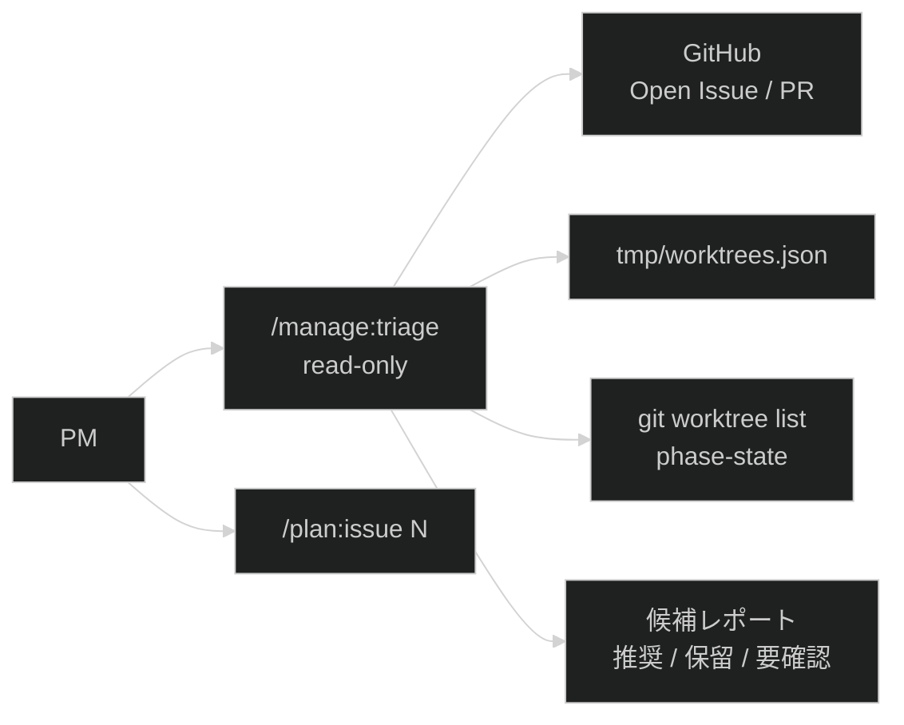

# 設計提案: Open Issueをグルーピングして着手優先順位を提案する

状態はfrontmatter(`status`・`proposed_at`・`approved_at`・`approved_by`・`implemented_at`・
`related`)が正本です。

## 目次

- [1. 問題と望ましい結果](#1-問題と望ましい結果)
- [2. 対象範囲](#2-対象範囲)
- [3. ユーザーワークフロー](#3-ユーザーワークフロー)
- [4. システム構成と責任分担](#4-システム構成と責任分担)
- [5. 主要な決定](#5-主要な決定)
- [6. 失敗時と運用](#6-失敗時と運用)
- [7. テスト戦略と受け入れ基準](#7-テスト戦略と受け入れ基準)
- [8. 実装と移行計画](#8-実装と移行計画)
- [9. 未解決事項](#9-未解決事項)

## 1. 問題と望ましい結果

Issue #142で、Issueごとのworktree作成、中央レジストリ、最大3件の並列実行、担当割り当て、
状態確認、承認付きcleanupを整備しました。一方で、次に着手するIssueの選定はPMが手動で
行っており、Open Issueが増えた場合に依存関係、準備度、作業競合、現在の空き枠を横断して
判断する共通手順がありません。

望ましい結果は、primary manager worktreeから`/manage:triage`を実行すると、Open Issueを
読み取り専用で分類し、空き枠の範囲で次に着手するIssue候補と根拠を提示できる状態です。
この提案はPMの意思決定を支援するものであり、Issue更新、worktree作成、worker起動は
行いません。着手するIssueが決まった後は、既存の`/plan:issue N`へ引き渡します。

## 2. 対象範囲

| 対象 | 対象外 |
| --- | --- |
| `/manage:triage`の読み取り専用コマンド契約 | GitHub Issue、Project、label、milestoneの更新 |
| Open Issueの収集、分類、優先順位提案の手順 | 自動で`/plan:issue`やworkerを起動する仕組み |
| `tmp/worktrees.json`と実在worktreeからの空き枠算出 | GitHub Project等の外部ボードを正本にする設計 |
| 事実とAI推測を分けた出力形式 | AI推測だけに基づく依存関係の確定 |
| 権限表、README、必要なテストの同期 | 新しい常駐プロセス、スケジューラー、MCP連携 |

## 3. ユーザーワークフロー

1. PMが次に着手するIssue候補を確認したいと判断します
2. マネージャーがprimary manager worktreeの`main`ブランチで`/manage:triage`を実行します
3. コマンドはGitHubのOpen Issue、関連PR、label、milestone、本文中の依存記述を読みます
4. コマンドは`tmp/worktrees.json`、実在worktree、各`phase-state.json`から稼働中Issueと
   空き枠を確認します
5. コマンドはIssueを分類し、空き枠を上限として推奨Issue、保留Issue、要確認Issueを提示します
6. PMが候補を選び、選択したIssueごとに`/plan:issue N`を実行します

## 4. システム構成と責任分担

| 構成要素 | 責任 | 責任外 |
| --- | --- | --- |
| `agent-workflow/commands/manage.md` | `/manage:triage`を含む管理系コマンドの契約を定義します | GitHub状態やworktree状態の正本化 |
| `/manage:triage` | Open Issueと稼働状態を読み、分類・優先順位・次ステップを提示します | Issue更新、worktree作成、worker起動 |
| `/manage:status` | 登録済みworktreeの観測値を同期します | 未着手Issueの候補選定 |
| `/plan:issue` | PMが選んだIssueのworktree作成と引き渡しを行います | 候補比較と優先順位判断 |
| `tmp/worktrees.json` | Issue、worktree、担当ツールの関連付けを保持します | backlog全体の正本 |
| GitHub Issue/PR | Open Issue、label、milestone、関連PR、本文上の依存記述の正本です | AI推測した依存関係の確定 |
| `tests/unit/consistency/agent-workflow.bats` | `/manage:triage`のコマンド契約、権限表、README同期の構造検証を担います | GitHub APIを使う実データ順位付けの完全検証 |

`/manage:triage`は、読み取った情報を次の2種類に分けて出力します。

| 種別 | 例 |
| --- | --- |
| 事実 | label、milestone、本文の明示依存、関連PR、稼働中worktree、Issue状態 |
| 推測 | 変更競合の可能性、作業規模、agent実行適性、依存解除効果 |

## 5. 主要な決定

| # | 論点 | 選択肢 | 決定 | 理由・トレードオフ |
| --- | --- | --- | --- | --- |
| 1 | コマンド配置 | (a) `/manage:status`へ統合 / (b) `/manage:triage`を追加 | (b) | 状態同期とbacklog判断は変更理由が異なります。`status`は観測値同期、`triage`はPM判断支援に分けます |
| 2 | 副作用 | (a) 推奨Issueを自動着手 / (b) read-onlyで提案だけ行う | (b) | PMの優先度判断を迂回しないためです。開始は既存の`/plan:issue N`が担います |
| 3 | 空き枠 | (a) 固定で3件提案 / (b) `3 - 稼働中Issue worktree数`を上限にする | (b) | Issue #142で定めた並列上限と整合します。上限到達時は候補提案だけを表示し、開始は促しません |
| 4 | 優先順位 | (a) 番号順 / (b) 複数評価軸の決定論的スコア | (b) | 依存解除効果や準備度を反映できます。同点時は重大度、依存解除効果、Issue番号の昇順で決定します |
| 5 | 依存関係 | (a) AI推測を依存として扱う / (b) 事実と推測を分ける | (b) | Issue本文やlabelで確認できる事実と、AIが読解した関連性を混ぜると誤った保留判断になります |
| 6 | 実装形態 | (a) 新規helperを作る / (b) まずコマンド文書中心で定義する | (b) | Issue本文は手順定義を求めています。GitHub更新やworktree操作を行わないため、既存シェルhelperの拡張は不要です |

## 6. 失敗時と運用

| 事象 | 扱い |
| --- | --- |
| GitHub参照失敗 | ローカル参照だけで順位を確定せず、GitHub未確認として停止または要確認にします |
| `tmp/worktrees.json`欠落 | 空レジストリとして扱い、実在worktreeから上限消費を確認します |
| registry schema不明 | 状態変更は行いません。triage結果は要確認として、`/manage:status`や修復を促します |
| 依存関係の循環 | 循環グループを「要確認」に分類し、循環を解くIssueをPM判断に委ねます |
| 情報不足 | `needs-info`等のlabel、本文欠落、受け入れ条件不足を事実として表示し、推奨候補から外します |
| 上限到達 | 空き枠0として報告し、`/manage:cleanup`または既存worktree完了を次ステップにします |

## 7. テスト戦略と受け入れ基準

| 検証層 | 内容 |
| --- | --- |
| 構造 | `agent-workflow/commands/manage.md`に`manage:triage`が追加され、目次とREADMEの一覧が同期します |
| 権限 | `command-permissions.md`で`/manage:triage`が`read-only`として定義されます |
| 手順レビュー | 分類、評価軸、同点規則、事実/推測の区別、失敗時の扱いがIssue #147の完了条件と対応します |
| 回帰 | `just verify`が成功します |

受け入れ基準はIssue #147の完了条件と一致させます。実GitHub APIの順位結果そのものは環境依存のため、
CIではコマンド文書と構造整合を中心に検証します。

## 8. 実装と移行計画

依存の浅い順に次を実装します。

1. `agent-workflow/commands/manage.md`へ`/manage:triage`の契約、手順、出力形式を追加します
2. `agent-workflow/rules/command-permissions.md`へ`/manage:triage`のread-only権限を追加します
3. `agent-workflow/commands/README.md`へ管理系コマンドの説明を同期します
4. 必要に応じて既存の構造検証で検出できるよう、READMEまたはコマンド一覧を更新します
5. `just verify`で文書、README、status、encoding、既存テストの整合を確認します

既存の永続データ移行はありません。`/manage:triage`は読み取り専用のため、既存の
`tmp/worktrees.json`やIssue worktreeに変更を加えません。

## 9. 未解決事項

- `plan:design`が参照する`tmp/docs/_template/design-proposal/design-proposal.md`は現行mainで
  見つかりませんでした。本Issueの実装範囲では既存設計文書の章構成を踏襲します。
