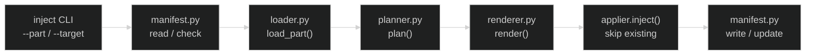

# 設計提案: inject サブコマンド — 既存プロジェクトへの Part 注入

状態はfrontmatter(`status`・`proposed_at`・`approved_at`・`approved_by`・`implemented_at`・
`related`)が正本です。

## 目次

- [1. 問題](#1-問題)
- [2. 対象範囲](#2-対象範囲)
- [3. 選択肢](#3-選択肢)
- [4. 設計案](#4-設計案)
- [5. 失敗とロールバック](#5-失敗とロールバック)
- [6. 検証](#6-検証)
- [7. 未解決事項](#7-未解決事項)

## 1. 問題

`generate` は一度だけ動く one-shot ツールであり、生成後に Part を追加する手段がない。
`starter-cli` で生成したプロジェクトを後から `architecture/ddd` などに育てたい場合、
手動でディレクトリを作成する必要がある。

## 2. 対象範囲

| 対象 | 対象外 |
| --- | --- |
| `inject` サブコマンドの実装（メカニズム） | `architecture/*` Parts の内容（別 Issue） |
| `strategy = "add"` のスキーマ・プランナー対応 | `scale/medium` / `scale/large` の内容（別 Issue） |
| `.template-manifest.toml` の生成・更新 | マニフェストを使ったアップグレード（将来） |
| `generate` 時のマニフェスト初期書き込み | 複数 Part の一括 inject（将来） |
| 生成プロジェクトの justfile への `inject` レシピ追加 |  |

## 3. 選択肢

| 案 | 内容 | 評価 |
| --- | --- | --- |
| A | manifest なし・二重適用は利用者責任 | シンプルだが安全でない |
| B | manifest あり・requires の連鎖を自動解決 | 安全だが実装が複雑 |
| C（採用） | manifest あり・requires は手動（エラーで案内） | 安全かつシンプル。利用者が制御を持つ |

案 C: 適用済み Parts をマニフェストで記録し、未適用の `requires` があれば
`just inject <requires-id>` を先に実行するよう案内してエラー終了する。

## 4. 設計案

### 4.1. パイプライン全体像



> **実装注記**: `inject` は単一 Part のみを処理するため Resolver を省略。複数 Part の一括 inject は将来対応（未解決事項 7.1）。

### 4.2. 変更ファイルと責務

| ファイル | 変更内容 |
| --- | --- |
| `template/schema/part_schema.py` | `STRATEGIES` に `"add"` を追加 |
| `tooling/generator/models.py` | `InjectResult` / `ManifestData` を追加（`InjectRequest` は `GenerateRequest` を流用） |
| `tooling/generator/errors.py` | `ManifestError` を追加 |
| `tooling/generator/manifest.py` | 新規: `.template-manifest.toml` の読み書き |
| `tooling/generator/planner.py` | `"add"` strategy: 先行 Part が同名ファイルを持つ場合はスキップ |
| `tooling/generator/applier.py` | `inject()` を追加: 既存ディレクトリ許容・既存ファイルはスキップ |
| `tooling/generator/loader.py` | `load_part()` を追加: 単一 Part のロード |
| `tooling/generator/cli.py` | `generate` にマニフェスト書き込みを追加 / `inject` サブコマンドを追加 |
| `template/parts/base/payload/justfile` | `inject` レシピを追加 |

### 4.3. `.template-manifest.toml` フォーマット

```toml
[manifest]
schema_version = "1"
project_name = "myapp"
generated_at = "2026-07-14"

[[applied]]
part_id = "base"
applied_at = "2026-07-14"

[[applied]]
part_id = "starter/cli"
applied_at = "2026-07-14"
```

- `generate` 時に全適用 Part を記録して生成
- `inject` 時に `[[applied]]` へ追記
- `manifest.project_name` を変数束縛に使用（`--name` 不要）

### 4.4. `strategy = "add"` の意味

`[[files]]` エントリの `strategy = "add"` は「先行 Part が同名ファイルを提供済みの場合はスキップ」
を意味する。`generate` でも `inject` でも同じ意味。

```toml
[[files]]
path = "docs/_templates/draft.md"
strategy = "add"
```

inject モードの applier は `strategy` に関わらず既存ターゲットファイルをスキップする（全ファイルが
実質 "add" 扱い）。

### 4.5. `inject` サブコマンドの動作

```text
inject --part <part-id> --target <dir>
```

1. `<dir>/.template-manifest.toml` を読む（なければ `ManifestError`）
2. `<part-id>` がマニフェストの `applied` に含まれていればエラー終了（二重適用防止）
3. Part の `requires` 全件がマニフェストに含まれているか確認。未適用のものがあれば
   `just inject <missing-part>` を案内してエラー終了
4. Part の `conflicts` がマニフェストの `applied` と重複する場合はエラー終了
5. `load_part(part_id)` でロード → `plan()` → `render()` → `applier.inject()`
6. マニフェストに `[[applied]]` を追記

### 4.6. `generate` へのマニフェスト追記

`apply()` 成功後に `write_manifest(output_path, parts, project_name)` を呼ぶ。
`generate` の冪等性（同名ディレクトリがあれば終了）はそのまま維持。

### 4.7. 生成プロジェクトの justfile

```just
# 既存プロジェクトに Part を追加する（例: just inject architecture/ddd）
inject part:
    nix run github:hisuilab/_template -- inject --part {{part}} --target .
```

## 5. 失敗とロールバック

| 失敗 | 段階 | 動作 |
| --- | --- | --- |
| マニフェストが存在しない | MANIFEST | エラー終了。`generate` で生成するよう案内 |
| Part がすでに適用済み | MANIFEST | エラー終了。二重適用を防止 |
| `requires` が未適用 | MANIFEST | エラー終了。必要な Part と適用順を案内 |
| Part が見つからない | LOAD | エラー終了。利用可能 Part 一覧を表示 |
| ファイル I/O エラー | INJECT | 書き込み済みファイルは残る（apply と異なり原子性なし）。マニフェストは更新しないのでリトライ可能 |

> [!NOTE]
> `generate` と異なり `inject` はロールバックしない。書き込みに失敗した場合は
> 手動で削除してリトライする。追加のみで上書きしないため影響範囲は限定的。

## 6. 検証

| 層 | 対象 | 内容 |
| --- | --- | --- |
| unit (`test_schema.py`) | `part_schema` | `strategy = "add"` が受理される |
| unit (`test_generator.py`) | `planner` | `"add"` strategy で先行 Part の同名ファイルが保持される |
| unit (`test_generator.py`) | `applier.inject` | 新規ファイルは追加・既存ファイルはスキップ |
| unit (`test_generator.py`) | `manifest` | read / write / update の正常系・異常系 |
| e2e (`test_generate_profiles.py`) | `generate` | 生成後に `.template-manifest.toml` が存在する |
| e2e (新規: `test_inject.py`) | `inject` | `generate` 後に別 Part を inject するシナリオ |

## 7. 未解決事項

| # | 論点 | 判断者 | ブロック |
| --- | --- | --- | --- |
| 1 | inject 失敗時に書き込み済みファイルを自動ロールバックするか | PM | なし（将来対応で可） |
| 2 | 複数 Part を一括 inject する `--parts` フラグを追加するか | PM | なし（将来対応で可） |
| 3 | `requires` の自動 inject（連鎖適用）を実装するか | PM | なし（将来対応で可） |
