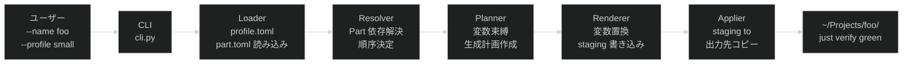

# Project Direction: _template

## 目次

- [1. 位置づけ](#1-位置づけ)
- [2. Why — 背景と動機](#2-why--背景と動機)
- [3. Who — 利用者](#3-who--利用者)
- [4. What — 提供する価値と機能](#4-what--提供する価値と機能)
- [5. Where — 適用範囲](#5-where--適用範囲)
- [6. When — フェーズと優先順位](#6-when--フェーズと優先順位)
- [7. システム構成（目標設計）](#7-システム構成目標設計)
- [8. モジュール責務と依存方向（目標設計）](#8-モジュール責務と依存方向目標設計)
- [9. 未解決の論点](#9-未解決の論点)

## 1. 位置づけ

`~/Projects/` 配下の新規プロジェクト立ち上げを効率化するための共通開発基盤テンプレートリポジトリです。
このリポジトリ自体がプロジェクト生成ツール（`tooling/`）と生成元となるProfile（`template/`）を提供します。

## 2. Why — 背景と動機

新規プロジェクトを起動するたびに、Nix flake・just・pre-commit・CI等の基盤を手動で構築していた。
`nix-station` にてこのテンプレートをベースとした開発を試み、基盤の有効性を確認済み。
nix-stationで蓄積された改善を取り込み、再利用可能な基盤として整備したい。

## 3. Who — 利用者

| 利用者 | 用途 |
| --- | --- |
| プロジェクト開始者（主にhisuilab） | 新規プロジェクトを生成コマンドで即座に立ち上げる |
| 既存プロジェクト管理者 | 基盤の更新を個別プロジェクトへ段階的に取り込む |

## 4. What — 提供する価値と機能

### 4.1. 共通開発基盤（実装済み）

| 機能 | 内容 |
| --- | --- |
| 再現可能な開発環境 | Nix flake によるdevShell |
| 統一フォーマット・lint | treefmt + rumdl |
| コミット品質ゲート | pre-commit（conventional-pre-commit, detect-secrets等） |
| タスクランナー | justfile |
| テスト | bats（シェルスクリプトユニットテスト） |
| CI | GitHub Actions（verify + check-readme） |
| 文書 status 検証 | `scripts/check-status`（docs/draft・milestones・decisions の frontmatter 妥当性） |

### 4.2. プロジェクト生成（目標設計）

- `tooling/generator/` （Python 3.11+）が `template/` のProfileを読み込み、新規プロジェクト一式を出力します
- 呼び出し形式: `python3 -m tooling.generator generate --name <name> --profile <profile> --output <path>`
- 生成されたプロジェクトは `just verify` で即座にグリーンになることを成功条件とします

### 4.3. Profileシステム（設計フェーズ）

スタイル × スケール × 用途の組み合わせでProfileを構成します。
各Profileはコンポーネント（Part）の組み合わせとして管理し、拡張性を確保します。

| 軸 | 候補値（暫定） |
| --- | --- |
| スタイル | prototype, layered, ddd |
| スケール | tiny, small, medium, large |
| 用途 | cli, web-api, library |

## 5. Where — 適用範囲

| 対象 | 説明 |
| --- | --- |
| 生成先 | `~/Projects/<name>/` 配下の新規ディレクトリ |
| 生成元 | このリポジトリ（`_template`）の `template/` ディレクトリ |
| ターゲット環境 | macOS + Nix（nixpkgsベース） |

**対象外:**

- 既存プロジェクトへの自動マイグレーション
- Nix以外の環境向けパッケージング（将来検討）

## 6. When — フェーズと優先順位

| フェーズ | 内容 | 状態 |
| --- | --- | --- |
| フェーズ0 | 基盤共通部分の確立（flake/just/lint/CI/pre-commit） | 完了（nix-stationで検証済み） |
| フェーズ1 | nix-stationの改善バックポート・要件/アーキテクチャ設計・Python/Ruff環境整備 | 完了 |
| フェーズ2 | `tooling/generator` 実装（最小Profile: small） | 未着手 |
| フェーズ3 | Profileシステムの設計（スタイル×スケール×用途） | 未着手 |

## 7. システム構成（目標設計）

### 7.1. 生成パイプライン



### 7.2. ディレクトリと役割

```text
_template/
├── tooling/
│   ├── __init__.py
│   └── generator/          # 生成パイプライン（Python パッケージ）
│       ├── cli.py           # CLI エントリポイント
│       ├── loader.py        # LOAD 段階
│       ├── resolver.py      # RESOLVE 段階
│       ├── planner.py       # PLAN 段階
│       ├── renderer.py      # RENDER 段階
│       ├── applier.py       # APPLY 段階
│       ├── models.py        # データ型（Request/Plan/Result）
│       └── errors.py        # 各段階エラー型
└── template/
    ├── schema/              # ProfileSchema / PartSchema（Python パッケージ）
    ├── profiles/            # Profile 宣言（*.toml）
    └── parts/               # コンポーネント群
        └── <layer>/<name>/
            ├── part.toml    # Part メタデータ・依存
            └── payload/     # 生成対象ファイル群（{{project_name}} 等のプレースホルダー）
```

## 8. モジュール責務と依存方向（目標設計）

### 8.1. モジュール責務

| モジュール | 責務 | 責務外 |
| --- | --- | --- |
| `cli.py` | 引数解析・エラー出力・終了コード制御 | ビジネスロジック |
| `loader.py` | profile.toml / part.toml のデシリアライズ | バリデーション以外のロジック |
| `resolver.py` | Part 間の依存解決・適用順序の決定 | ファイル生成 |
| `planner.py` | 変数束縛・生成ファイル計画の作成・ファイル競合検出 | ファイル I/O |
| `renderer.py` | `{{変数}}` 置換・staging ディレクトリへの書き込み | 出力先への直接書き込み |
| `applier.py` | staging → 出力先への原子的コピー | レンダリングロジック |
| `models.py` | データ型定義（GenerateRequest / GenerationPlan / GenerationResult） | ビヘイビア |
| `errors.py` | 各段階エラー型（LoadError / ResolveError / PlanError / RenderError / ApplyError） | ビヘイビア |
| `template/schema/` | ProfileSchema / PartSchema の定義・検証 | 生成ロジック |
| `template/profiles/` | Profile 宣言（使用 Part リスト・変数定義） | Part の内容 |
| `template/parts/` | Part ごとのファイル群（`payload/`） | Profile 間の組み合わせルール |

### 8.2. 依存方向

```text
tooling.generator.cli
  ├── tooling.generator.loader ──→ template.schema
  ├── tooling.generator.resolver
  ├── tooling.generator.planner
  ├── tooling.generator.renderer
  └── tooling.generator.applier
           └── tooling.generator.models（データのみ・他モジュールへの依存なし）

template.parts, template.profiles は実行時のファイル読み込み（Python import なし）
```

**依存の方向:** `tooling.generator` → `template.schema`（一方向）。逆方向の依存は禁止。

### 8.3. 失敗と再実行

| 失敗 | 段階 | 動作 |
| --- | --- | --- |
| profile.toml が見つからない | LOAD | エラー終了・利用可能 Profile 一覧表示 |
| part.toml が見つからない | LOAD | エラー終了・Part ID を報告 |
| Part 依存の循環・未解決 | RESOLVE | エラー終了・問題 Part ID を報告 |
| ファイル名衝突 | PLAN | エラー終了・競合ファイル名と関連 Part を報告 |
| `{{変数}}` が未置換 | RENDER後 | エラー終了・該当ファイルと変数名を報告 |
| 出力先ディレクトリが既存 | APPLY | エラー終了・上書きしない |
| APPLY 中の I/O エラー | APPLY | エラー終了・部分出力をクリーンアップ |

**冪等性:** APPLY 前に全出力を staging ディレクトリへ書き込むため、失敗時は出力先に何も残らない。再実行は安全。

## 9. 未解決の論点

| ID | 論点 | 影響範囲 | 優先度 |
| --- | --- | --- | --- |
| ~~U-01~~ | ~~`tooling/` の実装言語~~ | — | 解決済み（Python 3.11+。[2026-07-12-python-generator.md](../decisions/2026-07-12-python-generator.md) 参照） |
| U-02 | `src/` ディレクトリの扱い（ジェネレータ構成上不要。廃止または `template/parts/` 内の payload として再配置を検討） | リポジトリ構造 | 高 |
| U-03 | Profile（`template/`）の具体的なファイル構成（どのファイルを生成するか） | template/ 設計 | 中 |
| U-04 | スケール・スタイル・用途の具体的な候補値の確定 | Profileシステム設計 | 低（フェーズ3） |
| U-05 | 既存プロジェクト（nix-station等）への更新伝播方法 | 運用設計 | 低 |
