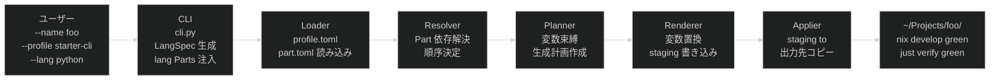
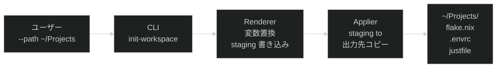

# Project Direction: _template

> [!IMPORTANT]
> **このドキュメントは移行済みのアーカイブです。現行仕様の正本は以下を参照してください。**
>
> - 要件: [`docs/requirements/product.md`](../requirements/product.md)
> - アーキテクチャ: [`docs/architecture/core.md`](../architecture/core.md)
>
> 本文は移行当時（2026-07-14）の記録です。以下の点は現行と異なります。
>
> - `purpose/*` / `small-cli` 等の名称は Issue #60 にて `starter/*` / `starter-cli` 等に改名済み
> - 7.2 節のディレクトリツリーにある `purpose/` は現在 `starter/` に相当します
> - 7.3 節の `--lang backend=python,frontend=typescript` 構文は Issue #109 にて不採用となり、代わりに `--role` によるモノレポ型生成が実装済みです（詳細: [`docs/design/issue-109-role-monorepo.md`](../design/issue-109-role-monorepo.md)）

## 目次

- [1. 位置づけ](#1-位置づけ)
- [2. Why — 背景と動機](#2-why--背景と動機)
- [3. Who — 利用者](#3-who--利用者)
- [4. What — 提供する価値と機能](#4-what--提供する価値と機能)
- [5. Where — 適用範囲](#5-where--適用範囲)
- [6. When — フェーズと優先順位](#6-when--フェーズと優先順位)
- [7. システム構成（目標設計）](#7-システム構成目標設計)
- [8. モジュール責務と依存方向（目標設計）](#8-モジュール責務と依存方向目標設計)
- [9. 未解決の論点](#9-未解決の論点)

## 1. 位置づけ

`~/Projects/` 配下の新規プロジェクト立ち上げを効率化するための共通開発基盤テンプレートリポジトリです。
このリポジトリ自体がプロジェクト生成ツール（`tooling/`）と生成元となるProfile（`template/`）を提供します。

## 2. Why — 背景と動機

新規プロジェクトを起動するたびに、Nix flake・just・pre-commit・CI等の基盤を手動で構築していた。
`nix-station` にてこのテンプレートをベースとした開発を試み、基盤の有効性を確認済み。
nix-stationで蓄積された改善を取り込み、再利用可能な基盤として整備したい。

## 3. Who — 利用者

| 利用者 | 用途 |
| --- | --- |
| プロジェクト開始者（主にhisuilab） | 新規プロジェクトを生成コマンドで即座に立ち上げる |
| 既存プロジェクト管理者 | 基盤の更新を個別プロジェクトへ段階的に取り込む |

## 4. What — 提供する価値と機能

### 4.1. 共通開発基盤（実装済み）

| 機能 | 内容 |
| --- | --- |
| 再現可能な開発環境 | Nix flake によるdevShell |
| 統一フォーマット・lint | treefmt + rumdl |
| コミット品質ゲート | pre-commit（conventional-pre-commit, detect-secrets等） |
| タスクランナー | justfile |
| テスト | bats（シェルスクリプトユニットテスト） |
| CI | GitHub Actions（verify + check-readme） |
| 文書 status 検証 | `scripts/check-status`（docs/draft・milestones・decisions の frontmatter 妥当性） |

### 4.2. プロジェクト生成（実装済み・拡張中）

- `tooling/generator/` （Python 3.11+）が `template/` のProfileを読み込み、新規プロジェクト一式を出力します
- 呼び出し形式:

| パターン | コマンド例 | 生成ディレクトリ構造 |
| --- | --- | --- |
| 単一言語 | `... --lang python` | `src/` |
| 複数言語（カジュアル） | `... --lang python,typescript` | `python/` `typescript/` |
| 役割指定（用途明確） | `... --lang backend=python,frontend=typescript` | `backend/` `frontend/` |

- `--lang` は必須。予約済み役割名: `backend` / `frontend` / `worker`
- 役割指定の省略形・エイリアスは提供しない（用途明確な場合は役割を明示する）
- 生成されたプロジェクトは `nix develop` で言語ランタイムが即座に使え、`just verify` がグリーンになることを成功条件とします

### 4.3. Profileシステム（実装中）

スタイル × スケール × 用途 × 言語の組み合わせでProfileを構成します。
各Profileはコンポーネント（Part）の組み合わせとして管理し、拡張性を確保します。

| 軸 | 候補値（暫定） | 状態 |
| --- | --- | --- |
| スタイル | prototype, layered, ddd | 未着手（フェーズ3） |
| スケール | tiny, small, medium, large | small のみ実装済み |
| 用途 | cli, web-api, library | 3種実装済み |
| 言語 | python, typescript | 未着手（フェーズ2完了条件） |

言語Partは `template/parts/lang/<name>/` に配置し、`--lang` フラグで選択します。言語Partは当該言語のランタイム・フォーマッタ・テストランナーを生成プロジェクトのdevShellへ追加します。

## 5. Where — 適用範囲

| 対象 | 説明 |
| --- | --- |
| 生成先 | `~/Projects/<name>/` 配下の新規ディレクトリ |
| 生成元 | このリポジトリ（`_template`）の `template/` ディレクトリ |
| ターゲット環境 | macOS + Nix（nixpkgsベース） |

**対象外:**

- 既存プロジェクトへの自動マイグレーション
- Nix以外の環境向けパッケージング（将来検討）

## 6. When — フェーズと優先順位

| フェーズ | 内容 | マイルストーン | 状態 |
| --- | --- | --- | --- |
| フェーズ0 | 基盤共通部分の確立（flake/just/lint/CI/pre-commit） | — | 完了（nix-stationで検証済み） |
| フェーズ1 | nix-stationの改善バックポート・要件/アーキテクチャ設計・Python/Ruff環境整備 | — | 完了 |
| フェーズ2 | `tooling/generator` 実装・言語Part追加・`prototype → main` PR | M1–M5 | 完了 |
| フェーズ3 | 言語環境の充実・グローバル呼び出し・features Part 追加 | M6–M8 | 完了 |
| フェーズ4 | AI/DX 開発環境 Part 拡張・`~/Projects` 親環境の整備 | M9–M10 | 未着手 |
| フェーズ5 | 複数 lang 対応（append 戦略）・Profile システム拡張 | M11+ | 未着手（フェーズ4完了後に設計） |

| マイルストーン | 内容 | フェーズ | モード |
| --- | --- | --- | --- |
| M1 | `template/` レイヤー設計・スキーマ・プロファイル宣言ファイル | フェーズ2 | Prototype |
| M2 | `template/parts/` payload 実装（代表3プロファイルの生成ファイル群） | フェーズ2 | Prototype |
| M3 | `tooling/generator/` パイプライン実装（loader/resolver/planner/renderer/applier） | フェーズ2 | Prototype |
| M4 | エンドツーエンド統合（e2e テスト・rumdl.toml 追加） | フェーズ2 | Prototype |
| M5 | `lang/` Part 追加（`--lang` フラグ・python/typescript 対応）と `prototype → main` PR | フェーズ2 | Prototype |
| M6 | TypeScript lint 整備（Biome 導入） | フェーズ3 | Production |
| M7 | `nix run` flake app 対応（グローバル呼び出し） | フェーズ3 | Production |
| M8 | `features/logging` Part 追加（Python / TypeScript） | フェーズ3 | Production |
| M9 | `features/ai-agent` Part 拡張（AI ワークフロー設定ファイル群の汎用化） | フェーズ4 | Production |
| M10 | `~/Projects` 親環境の整備（ワークスペース初期化コマンド追加） | フェーズ4 | Production |

## 7. システム構成（目標設計）

### 7.1. 生成パイプライン



### 7.2. ディレクトリと役割

```text
_template/
├── tooling/
│   ├── __init__.py
│   └── generator/          # 生成パイプライン（Python パッケージ）
│       ├── cli.py           # CLI エントリポイント（generate・init-workspace サブコマンド）
│       │                    # 【目標設計 M10】init-workspace サブコマンドを追加
│       ├── loader.py        # LOAD 段階
│       ├── resolver.py      # RESOLVE 段階
│       ├── planner.py       # PLAN 段階
│       ├── renderer.py      # RENDER 段階
│       ├── applier.py       # APPLY 段階
│       ├── models.py        # データ型（LangSpec / GenerateRequest / Plan / Result）
│       └── errors.py        # 各段階エラー型
└── template/
    ├── schema/              # ProfileSchema / PartSchema（Python パッケージ）
    ├── profiles/            # Profile 宣言（*.toml）
    ├── workspaces/          # ワークスペーステンプレート（Parts システムを使わない固定テンプレート）
    │   └── default/         # 【目標設計 M10】flake.nix・.envrc・justfile
    └── parts/               # コンポーネント群
        ├── base/            # 全プロファイル共通基盤
        ├── scale/           # スケール別 Part（small 等）
        ├── starter/         # 用途別 Part（cli / web-api / library）。移行当時は purpose/ という名称でした（Issue #60 で改名）
        ├── features/        # オプション機能 Part
        │   ├── ai-agent/    # AGENTS.md・CLAUDE.md・.claude/rules/dev-policy.md
        │   │                # 【目標設計 M9】.claude/ scaffold を追加
        │   ├── logging-python/     # src/logger.py（stdlib logging）
        │   └── logging-typescript/ # src/logger.ts（console ベース）
        └── lang/            # 言語環境 Part（python / typescript）
            └── <name>/
                ├── part.toml    # requires = ["base"]・file_rules で flake.nix を replace
                └── payload/     # flake.nix（base + lang packages）・treefmt.nix・justfile
```

### 7.3. `--lang` 解決ルール（目標設計）

`--lang` フラグは CLI が解析して `LangSpec` のリストに変換し、Loader が profile の parts リストへ末尾注入します。既存の Resolver・Planner は変更なしに動作します。

| `--lang` 形式 | 例 | LangSpec | 注入 Part | 生成ディレクトリ |
| --- | --- | --- | --- | --- |
| 単一言語 | `--lang python` | `role=None, lang=python` | `lang/python` | `src/`（purpose Part が提供） |
| 単一言語 | `--lang typescript` | `role=None, lang=typescript` | `lang/typescript` | `src/`（purpose Part が提供） |
| 複数言語（役割なし） | `--lang python,typescript` | 各 `role=None` | `lang/python` + `lang/typescript` | `python/` `typescript/`【M6+】 |
| 役割指定 | `--lang backend=python,frontend=typescript` | `role=backend/frontend` | `lang/python` + `lang/typescript` | `backend/` `frontend/`【M6+】 |

**予約済み役割名:** `backend` / `frontend` / `worker`

**M5 実装範囲:** 単一言語のみ（`role=None` かつ lang が 1 つ）。複数・役割指定は M6+ でappend戦略が揃ってから実装します。M5 では複数指定時にエラー終了します。

> [!NOTE]
> Issue #109 にて、この`--lang backend=python,frontend=typescript`構文（単一flakeへの
> append戦略マージ）は採用せず、代わりに`--role name:profile=<p>[,lang=<l>]`によるモノレポ型
> 生成（役割ごとに独立した`_do_generate`実行、`lang/*`間の`conflicts`はそのまま維持）を実装
> しました。詳細は[`docs/design/issue-109-role-monorepo.md`](../design/issue-109-role-monorepo.md)
> を参照してください。

**`flake.nix` の replace 戦略:** `lang/<name>` Part は `file_rules` で `path = "flake.nix", strategy = "replace"` を宣言し、base packages + lang packages をまとめた完全な `flake.nix` を提供します。base の `flake.nix` は `--lang` なし時のフォールバックとして残します。

### 7.4. `init-workspace` フロー（目標設計 M10）

`nix run ... -- init-workspace --path ~/Projects` で呼び出す。Parts システムを使わず、`template/workspaces/default/` の固定テンプレートを applier で直接適用します。



> [!NOTE]
> `generate` サブコマンドと異なり、Loader・Resolver・Planner を経由しません。ワークスペースは Parts の組み合わせではなく単一の固定テンプレートとして扱います。

## 8. モジュール責務と依存方向（目標設計）

### 8.1. モジュール責務

| モジュール | 責務 | 責務外 |
| --- | --- | --- |
| `cli.py` | 引数解析（`--lang` 含む）・`LangSpec` 生成・lang Parts 注入・エラー出力・終了コード制御。【目標設計 M10】`init-workspace` サブコマンドを追加 | ビジネスロジック |
| `loader.py` | profile.toml / part.toml のデシリアライズ・lang Parts の読み込み | バリデーション以外のロジック |
| `resolver.py` | Part 間の依存解決・適用順序の決定 | ファイル生成 |
| `planner.py` | 変数束縛・生成ファイル計画の作成・ファイル競合検出 | ファイル I/O |
| `renderer.py` | `{{変数}}` 置換・staging ディレクトリへの書き込み | 出力先への直接書き込み |
| `applier.py` | staging → 出力先への原子的コピー | レンダリングロジック |
| `models.py` | データ型定義（`LangSpec` / `GenerateRequest` / `GenerationPlan` / `GenerationResult`） | ビヘイビア |
| `errors.py` | 各段階エラー型（LoadError / ResolveError / PlanError / RenderError / ApplyError） | ビヘイビア |
| `template/schema/` | ProfileSchema / PartSchema の定義・検証 | 生成ロジック |
| `template/profiles/` | Profile 宣言（使用 Part リスト・変数定義） | Part の内容・lang 指定 |
| `template/parts/base/` | 全プロファイル共通基盤ファイル（flake.nix フォールバック・justfile・rumdl.toml 等） | 言語環境 |
| `template/parts/lang/` | 言語環境 Part（devShell・treefmt・justfile の言語固有設定） | アプリケーションコード・ディレクトリ構造 |
| `template/parts/starter/` | 用途別コードスケルトン（`src/` 構成）。移行当時は `purpose/` という名称でした（Issue #60 で改名） | 言語環境 |
| `template/parts/features/` | オプション機能 Part（ai-agent・logging 等）。【目標設計 M9】ai-agent は `AGENTS.md`・`CLAUDE.md`・`.claude/rules/dev-policy.md` を提供 | lang 固有設定・ディレクトリ構造 |
| `template/workspaces/` | 【目標設計 M10】`init-workspace` が使う固定テンプレート群（Parts システム不使用）。`default/` が標準ワークスペース | プロジェクト生成・Parts 合成 |

### 8.2. 依存方向

```text
tooling.generator.cli
  ├── tooling.generator.loader ──→ template.schema
  ├── tooling.generator.resolver
  ├── tooling.generator.planner
  ├── tooling.generator.renderer
  └── tooling.generator.applier
           └── tooling.generator.models（データのみ・他モジュールへの依存なし）

template.parts, template.profiles は実行時のファイル読み込み（Python import なし）
```

**依存の方向:** `tooling.generator` → `template.schema`（一方向）。逆方向の依存は禁止。

### 8.3. 失敗と再実行

| 失敗 | 段階 | 動作 |
| --- | --- | --- |
| `--lang` 未指定 | CLI | エラー終了・`--lang` 必須の旨と利用可能な lang 一覧を表示 |
| `--lang` に複数指定（M5 時点） | CLI | エラー終了・複数 lang は M6+ 対応予定の旨を表示 |
| `--lang` に未知の言語名 | CLI | エラー終了・利用可能な lang 一覧を表示 |
| profile.toml が見つからない | LOAD | エラー終了・利用可能 Profile 一覧表示 |
| lang Part の part.toml が見つからない | LOAD | エラー終了・lang Part ID を報告 |
| part.toml が見つからない | LOAD | エラー終了・Part ID を報告 |
| Part 依存の循環・未解決 | RESOLVE | エラー終了・問題 Part ID を報告 |
| ファイル名衝突 | PLAN | エラー終了・競合ファイル名と関連 Part を報告 |
| `{{変数}}` が未置換 | RENDER後 | エラー終了・該当ファイルと変数名を報告 |
| 出力先ディレクトリが既存 | APPLY | エラー終了・上書きしない |
| APPLY 中の I/O エラー | APPLY | エラー終了・部分出力をクリーンアップ |

**冪等性:** APPLY 前に全出力を staging ディレクトリへ書き込むため、失敗時は出力先に何も残らない。再実行は安全。

## 9. 未解決の論点

| ID | 論点 | 影響範囲 | 優先度 |
| --- | --- | --- | --- |
| ~~U-01~~ | ~~`tooling/` の実装言語~~ | — | 解決済み（Python 3.11+。[2026-07-12-python-generator.md](../decisions/2026-07-12-python-generator.md) 参照） |
| ~~U-02~~ | ~~`src/` ディレクトリの扱い~~ | — | 解決済み（lang Part が `src/` または役割ディレクトリを提供。リポジトリ内の `src/` は削除済み） |
| ~~U-03~~ | ~~Profile の具体的なファイル構成~~ | — | 解決済み（M1–M4 で代表3プロファイルを実装。lang Part は M5 で追加） |
| U-04 | スケール・スタイル・用途の具体的な候補値の確定 | Profileシステム設計 | 低（フェーズ5） |
| U-05 | 既存プロジェクト（nix-station等）への更新伝播方法 | 運用設計 | 低 |
| U-06 | 複数 lang Part の `flake.nix` マージ戦略（`append` 戦略）。`--lang python,typescript` のフルスタック構成で必要。現状は単一言語の `replace` のみ対応 | generator/planner 設計 | 中（フェーズ5で対応予定） |
| U-07 | 予約済み役割名（`backend`/`frontend`/`worker`）以外の役割が必要になった場合の語彙管理 | CLI 設計 | 低（フェーズ5） |
| U-08 | `features/ai-agent` Part の汎用化スコープ。`AGENTS.md`・`CLAUDE.md` のみ提供する現行に対し、`.claude/commands/`・`.claude/rules/` 等の AI ワークフロー設定ファイル群をどこまで生成対象に含めるか。`.claude/` が汎用設計に安定するまで確定できない | M9 設計 | 高（フェーズ4） |
| U-09 | `~/Projects` 親環境の提供方式。ジェネレータの新サブコマンド（`init-workspace`）として実装するか、独立したスクリプトとして提供するか。direnv + nix のネストは問題なし（確認済み） | M10 設計 | 中（フェーズ4） |
