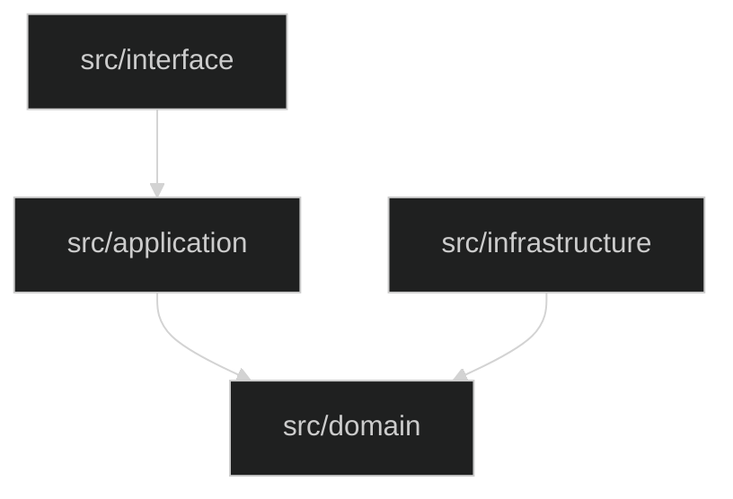

# 依存関係図

```mermaid
%%{init: {"theme": "dark"}}%%
graph TD
    interface["src/interface"] --> application["src/application"]
    application --> domain["src/domain"]
    infrastructure["src/infrastructure"] --> domain
```
